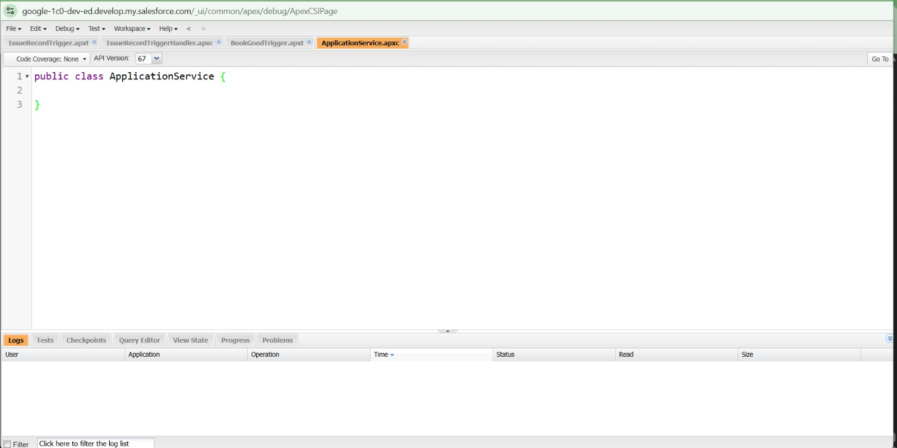

# Engineering Sprint 1 – Creating the Application Service

# Sprint Objective

Create a dedicated Apex service class named **ApplicationService** that will handle all application-related business operations in future sprints.

This sprint focuses only on creating a clean foundation for the business service without implementing any logic.

---

# Business Requirement

The Placement Office requires a dedicated service responsible for handling all application-related operations.

Instead of placing business logic throughout the project, it should be organized inside one service class for better readability and maintainability.

---

# Task Completed

- Created the `ApplicationService` Apex class.
- Kept the class clean with no unnecessary code.
- Prepared the class for future business operations.

---

# Apex Class

```apex
public class ApplicationService {

}
```

---

# Screenshot




---

# Expected Outcome

A dedicated service class has been created to manage application-related business logic in future sprints.

---

# Learning Outcome

Through this sprint, I learned:

- The purpose of a Service Class.
- Why business logic should be separated from other parts of the application.
- The importance of creating a clean project structure before implementation.

---


# Conclusion

Successfully created the `ApplicationService` class, providing a clean and maintainable foundation for implementing business logic in the upcoming engineering sprints.
