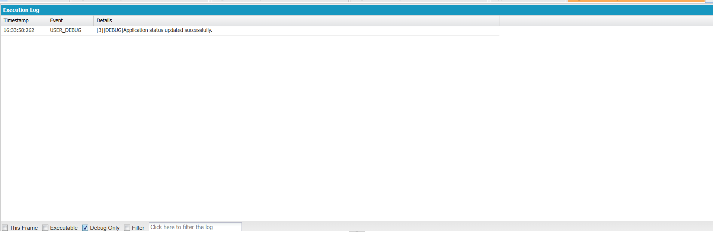

# Engineering Sprint 11 – Updating Application Status

# Sprint Objective

Update the status of an existing application after recruiter action.

---

# Business Requirement

After the interview process, the recruiter should be able to update the application status to reflect the candidate's progress.

Possible status values include:

- Applied
- Shortlisted
- Interview Scheduled
- Selected
- Rejected

---

# Tasks Completed

- Retrieved the required Application record using SOQL.
- Updated the Status field.
- Saved the changes using DML (`update`).
- Displayed a confirmation message after successful update.
- Handled exceptions using `try-catch`.

---

# Expected Behaviour

The selected Application record is updated with the new status and a confirmation message is returned.

---

# Screenshots

## Debug Output

---

# Learning Outcome

During this sprint, I learned:

- How to retrieve an existing record using SOQL.
- How to update records using DML.
- How to implement update operations in Apex.
- How to handle update exceptions using `try-catch`.

---

# Engineering Principle

Update existing records when business information changes instead of creating duplicate records.

---

# Conclusion

Successfully implemented functionality to update the application status after recruiter action. The application now supports changes to the recruitment process while maintaining the existing record.
