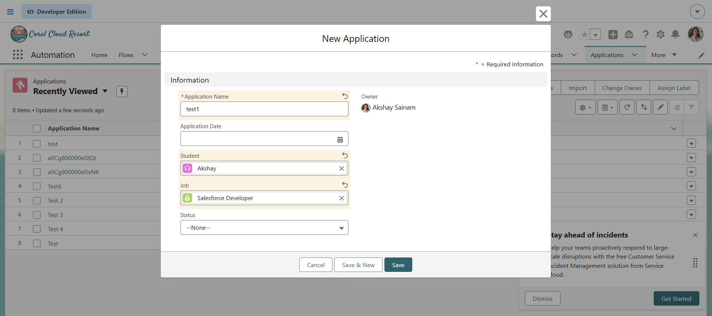
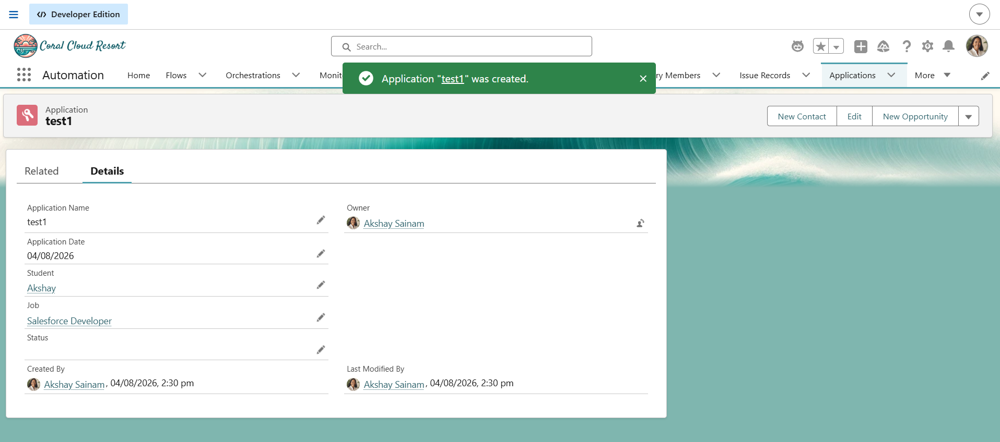

# Engineering Sprint 13 – Responding to a New Application

# Sprint Objective

Automatically validate new application records whenever they are created using a Salesforce Trigger.

---

# Business Requirement

Whenever a student submits an application, the system should automatically perform validation before allowing the record to be saved.

The Trigger should not contain business logic. Instead, it should delegate the validation process to the existing `ApplicationService`.

---

# Tasks Completed

- Created a **Before Insert Trigger** on `Application__c`.
- Delegated validation responsibility to `ApplicationService`.
- Kept the Trigger clean and readable.
- Followed the Service Layer architecture.

---

# Trigger Flow

```text
New Application
       ↓
Application Trigger
       ↓
ApplicationService
       ↓
Validation
       ↓
Save Record
```

# Expected Behaviour

When a new Application record is created:

- The Trigger executes automatically.
- Validation is delegated to `ApplicationService`.
- Salesforce continues saving the record if validation succeeds.

---

# Screenshots

## New Application



---

## Result



---

# Engineering Principle

A Trigger should coordinate business events, not implement business logic.

Business logic belongs inside Service classes.

---

# Learning Outcome

During this sprint I learned:

- Creating Salesforce Triggers.
- Understanding Before Insert events.
- Delegating work to Service classes.
- Keeping Triggers clean and maintainable.

---

# Conclusion

Successfully implemented a Trigger that automatically responds to new Application records while keeping all business logic inside the ApplicationService class.
