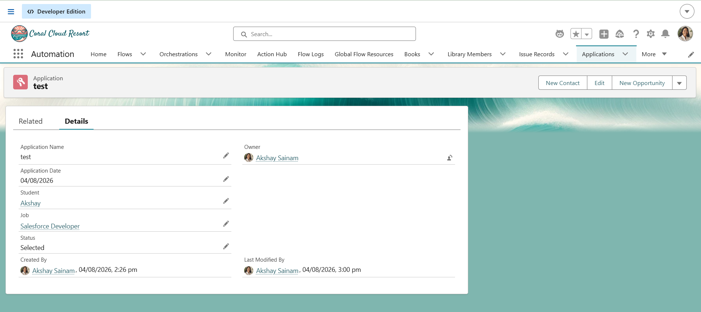

# Engineering Sprint 14 – Updating Placement Statistics

# Sprint Objective

Automatically update placement statistics whenever an Application status changes to **Selected**.

---

# Business Requirement

When a student's application status changes to **Selected**, the Trigger should notify a dedicated `StatisticsService`.

The Trigger should not perform calculations directly.

---

# Tasks Completed

- Created a `StatisticsService`.
- Delegated statistics updates from the Trigger.
- Kept the Trigger short and maintainable.
- Followed Service Layer architecture.

---

# Trigger Flow

Application Status Updated
↓
Application Trigger
↓
StatisticsService
↓
Update Placement Statistics

---

# Expected Behaviour

Whenever an Application status changes to **Selected**, the Trigger automatically invokes `StatisticsService`.

---

# Screenshots

## Result

---

# Engineering Principle

A Trigger should coordinate events, while specialised Service classes perform business operations.

---

# Learning Outcome

- Learned to delegate work to specialised services.
- Understood why Triggers should remain small.
- Improved application maintainability through separation of responsibilities.

---

# Conclusion

Successfully implemented a Trigger that delegates placement statistic updates to a dedicated service whenever an Application is selected.
