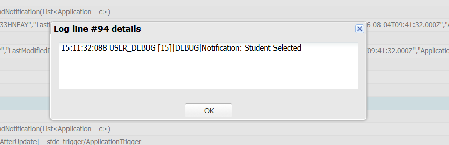

# Engineering Sprint 15 – Sending Notifications

# Sprint Objective

Automatically notify users whenever important placement events occur.

---

# Business Requirement

When an Application status changes to an important business event such as:

- Interview Scheduled
- Selected
- Rejected
- Offer Accepted

the Trigger should delegate notification responsibility to a dedicated `NotificationService`.

---

# Tasks Completed

- Created a `NotificationService`.
- Delegated notification handling from the Trigger.
- Kept the Trigger simple and maintainable.
- Followed Service Layer architecture.

---

# Trigger Flow

Application Status Updated

↓

Application Trigger

↓

NotificationService

↓

Send Notification

---

# Expected Behaviour

Whenever an important Application status change occurs, the Trigger automatically invokes `NotificationService`.

---

# Screenshots

## Result

---

# Engineering Principle

The Trigger should know **when** an event occurs.

The NotificationService should know **how** notifications are handled.

---

# Learning Outcome

- Learned to separate notification logic from Trigger logic.
- Understood the importance of specialised Service classes.
- Improved application maintainability.

---

# Conclusion

Successfully implemented a NotificationService that responds to important Application status changes while keeping the Trigger clean and reusable.
