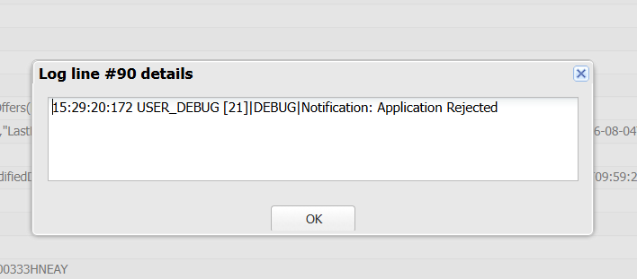
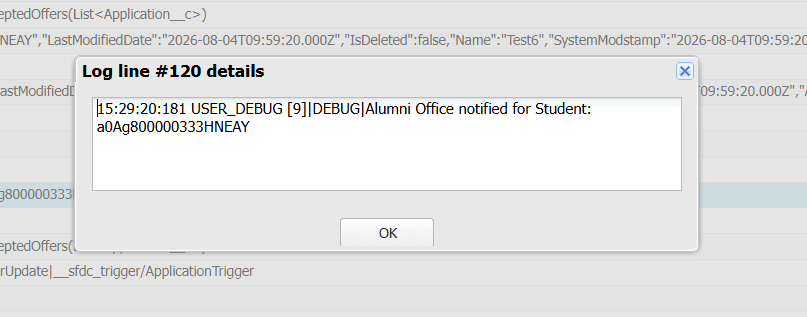

# Engineering Sprint 16 – Preparing for Tomorrow's Requirements

# Sprint Objective

Design the Trigger architecture so that new business requirements can be added without rewriting the Trigger or existing service classes.

---

# Business Requirement

Whenever a student accepts an offer, the Alumni Office should automatically receive the student's details.

Instead of modifying existing business logic, a new specialised `AlumniService` is introduced.

---

# Tasks Completed

- Created `AlumniService`.
- Delegated Alumni Office processing from the Trigger.
- Extended the application without changing existing business logic.
- Followed modular Trigger architecture.

---

# Trigger Flow

Application Status Updated

↓

Application Trigger

↓

StatisticsService

↓

NotificationService

↓

AlumniService

---

# Expected Behaviour

When an Application status changes to **Offer Accepted**, the Trigger automatically invokes `AlumniService`.

---

# Screenshots

## Outputs

---

---

# Engineering Principle

Good architecture allows new business requirements to be added by introducing new services instead of rewriting existing components.

---

# Learning Outcome

During this sprint, I learned:

- Extending an application without changing existing logic.
- Designing reusable Trigger architecture.
- Delegating new responsibilities to specialised Service classes.
- Building scalable enterprise applications.

---

# Conclusion

Successfully extended the Trigger architecture by introducing `AlumniService`, demonstrating how new business requirements can be supported while keeping the Trigger clean and maintainable.
