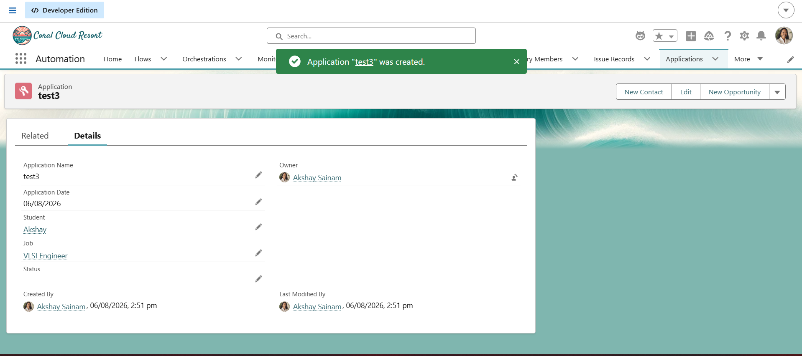
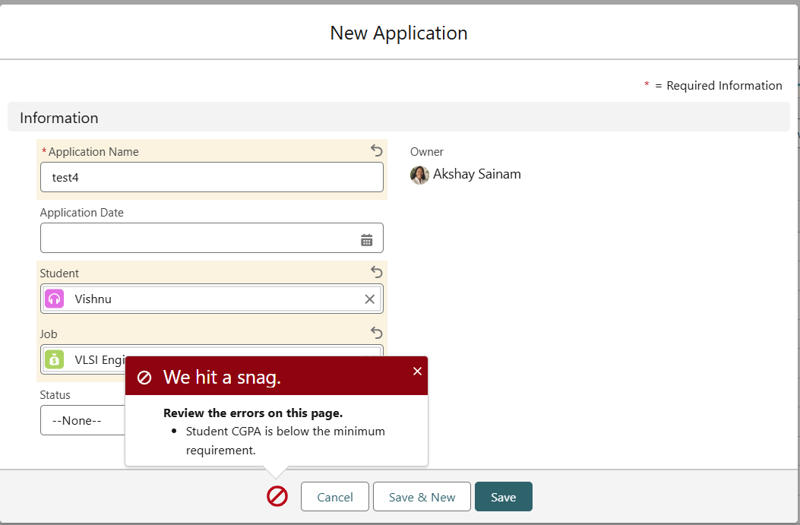
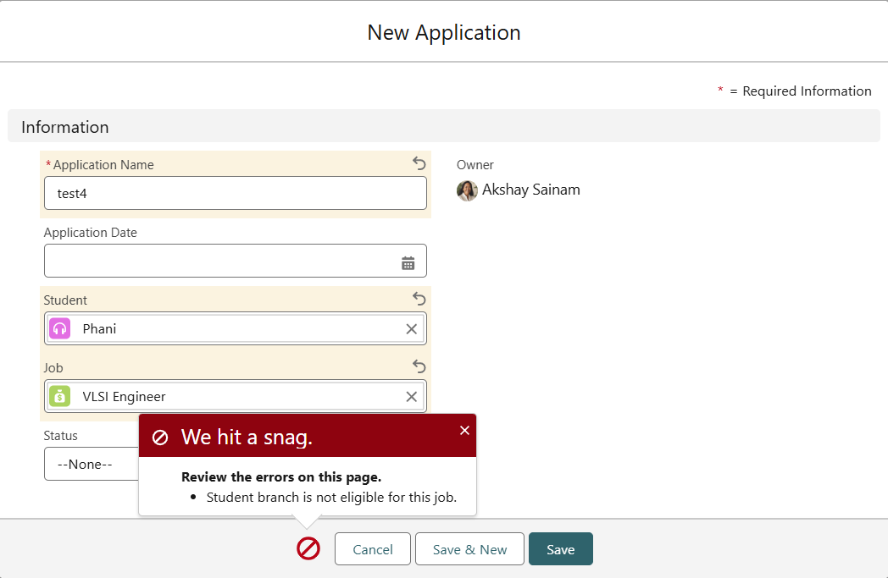
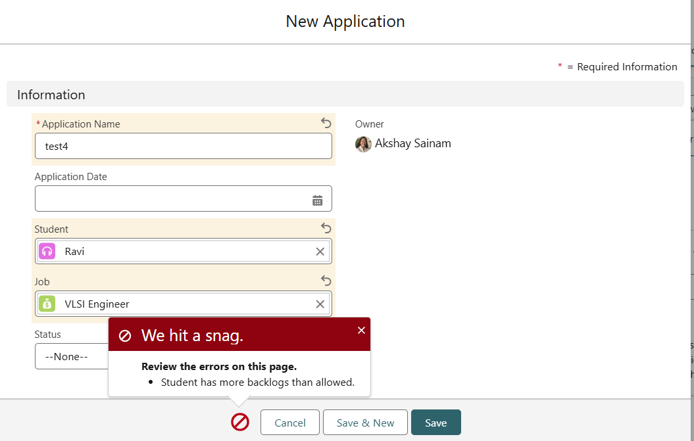

# Engineering Sprint 17 – Bulkifying Eligibility Validation

# Sprint Objective

Implement bulk-safe eligibility validation for student job applications using Apex collections.

---

# Business Requirement

The application should validate multiple application records in a single transaction without exceeding Salesforce governor limits.

The validation checks include:

- Student CGPA
- Student Backlogs
- Student Branch
- Job Minimum CGPA
- Job Allowed Backlogs
- Job Allowed Branch

The solution should retrieve data using bulk SOQL queries and perform all validations in memory.

---

# Tasks Completed

- Used `Set<Id>` to collect Student and Job IDs.
- Retrieved Student records using a single SOQL query.
- Retrieved Job records using a single SOQL query.
- Stored records in Maps for quick lookup.
- Validated all Application records without using SOQL inside loops.
- Automatically populated Application Date when it was empty.
- Used `addError()` to prevent invalid applications from being saved.

---

# Bulk Processing Flow

```text
Application Records
        │
        ▼
Collect Student IDs & Job IDs
        │
        ▼
Bulk SOQL Queries
        │
        ▼
Store Records in Maps
        │
        ▼
Validate Each Application
        │
        ▼
Save Valid Records / Reject Invalid Records
```

---

# Expected Behaviour

The application successfully validates one or multiple application records in a single transaction while following Salesforce bulk processing best practices.

---

# Screenshots

## Valid Application



---

## Low CGPA Validation



---

## Wrong Branch Validation



---

## More Backlogs Validation



---

# Engineering Principle

Never place SOQL queries inside loops.

Use Sets, Maps, and bulk SOQL queries to process multiple records efficiently and remain within Salesforce governor limits.

---

# Learning Outcome

During this sprint, I learned:

- How to bulkify Apex code.
- How to use Sets and Maps effectively.
- How to retrieve related records using bulk SOQL.
- How to validate multiple records in memory.
- How to write governor-limit-friendly Apex code.

---

# Conclusion

Successfully implemented bulkified eligibility validation for the Placement Management System. The application now processes multiple Application records efficiently using Sets, Maps, bulk SOQL, and in-memory validation while complying with Salesforce governor limits.
