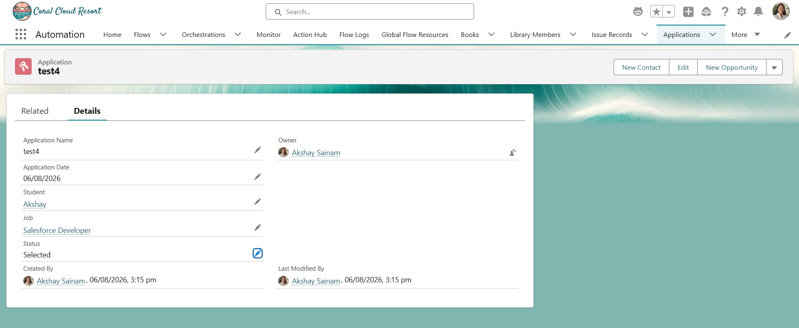
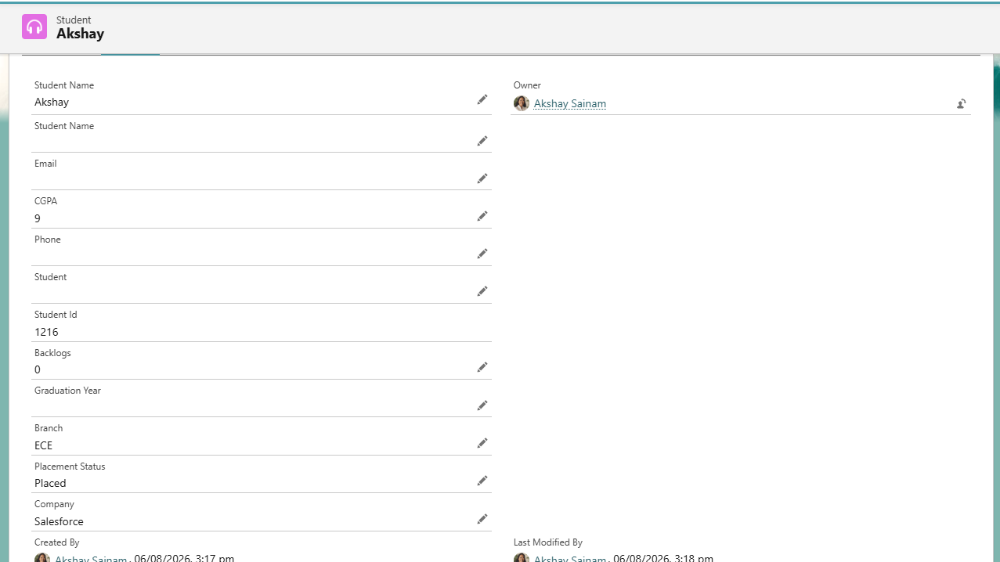

# Engineering Sprint 18 – Detecting Selection in Bulk

# Sprint Objective

Implement bulk-safe processing to detect when an Application status changes to **Selected** and update the corresponding Student records.

---

# Business Requirement

When an Application status changes from a non-selected status to **Selected**, the system should:

- Detect the status change using `Trigger.oldMap`.
- Update the Student's Placement Status.
- Store the selected Company in the Student record.
- Process multiple Application records efficiently using bulk Apex.

---

# Tasks Completed

- Created `ApplicationTriggerHandler`.
- Used `Trigger.oldMap` to detect status changes.
- Retrieved Student records using a single SOQL query.
- Retrieved Job records using a single SOQL query.
- Used Maps for efficient record lookup.
- Updated Student records in memory.
- Performed a single bulk DML update.

---

# Bulk Processing Flow

```text
Application Records Updated
            │
            ▼
Compare Trigger.oldMap & Trigger.new
            │
            ▼
Identify Selected Applications
            │
            ▼
Collect Student IDs & Job IDs
            │
            ▼
Bulk SOQL Queries
            │
            ▼
Update Student Placement Status
            │
            ▼
Bulk DML Update
```

---

# Expected Behaviour

Whenever an Application status changes to **Selected**, the related Student record is automatically updated.

The Student record should display:

- Placement Status = Placed
- Company = Selected Company

The solution supports bulk processing and follows Salesforce governor limit best practices.

---

# Screenshots

## Selected Application



---

## Updated Student Record



---

# Engineering Principle

Use `Trigger.oldMap` to compare previous and current record values.

Use Sets, Maps, bulk SOQL, and bulk DML to efficiently process multiple records in Salesforce.

---

# Learning Outcome

During this sprint, I learned:

- How to use `Trigger.oldMap`.
- How to detect field value changes.
- How to bulkify update operations.
- How to update related records efficiently.
- How to follow Salesforce governor limit best practices.

---

# Conclusion

Successfully implemented bulk-safe processing for Application status updates. The system now detects when students are selected and automatically updates their placement details while supporting bulk operations and maintaining clean Trigger architecture.
