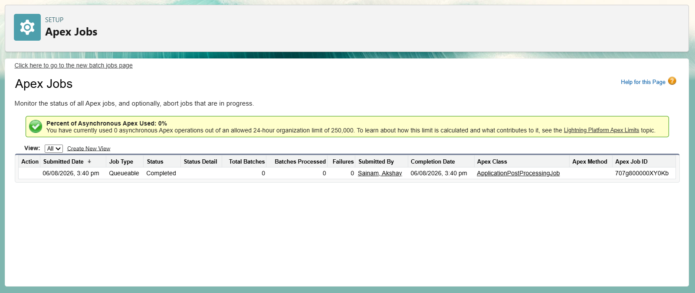
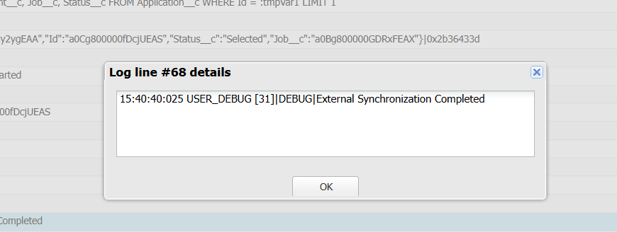

# Engineering Sprint 19 – Moving Secondary Work to Queueable Apex

# Sprint Objective

Move secondary business operations to Queueable Apex so that the essential user transaction completes quickly while background processing executes asynchronously.

---

# Business Requirement

When an Application status changes to **Selected**, Salesforce should:

- Complete the essential transaction immediately.
- Update the related Student record.
- Return confirmation to the user.
- Move secondary processing to a Queueable Apex job.

Background processing includes:

- Preparing notifications
- Preparing analytics
- External synchronization

---

# Tasks Completed

- Created `ApplicationPostProcessingJob` implementing the `Queueable` interface.
- Passed only the `Application Id` to the Queueable job.
- Retrieved required records inside the Queueable class.
- Updated `ApplicationTriggerHandler` to enqueue the background job after the synchronous transaction.
- Maintained separation between synchronous and asynchronous processing.

---

# Architecture

```text
Application Selected
        │
        ▼
ApplicationTrigger
        │
        ▼
ApplicationTriggerHandler
        │
        ▼
Update Student Record
        │
        ▼
System.enqueueJob()
        │
        ▼
ApplicationPostProcessingJob
        │
        ├── Prepare Notifications
        ├── Prepare Analytics
        └── External Synchronization
```

---

# Expected Behaviour

When an Application status changes to **Selected**:

- Student information is updated immediately.
- A Queueable Apex job is submitted.
- Background processing executes independently without delaying the user transaction.

---

# Screenshots

## Selected Application


---

## Updated Student Record


---

## Apex Jobs



---

## Debug Log



---

# Engineering Principle

Only the work required to complete the user's request should execute synchronously.

Secondary activities should be moved to Queueable Apex so they execute in the background without slowing the user experience.

---

# Learning Outcome

During this sprint, I learned:

- How Queueable Apex works.
- How to enqueue asynchronous jobs using `System.enqueueJob()`.
- Why only essential work should remain in the user transaction.
- How to pass minimal information (`Application Id`) to a Queueable job.
- How to separate synchronous and asynchronous responsibilities.

---

# Conclusion

Successfully implemented Queueable Apex for post-application processing in the Placement Management System. Essential business operations complete immediately, while notifications, analytics, and external synchronization are processed asynchronously, resulting in a cleaner and more scalable application architecture.
