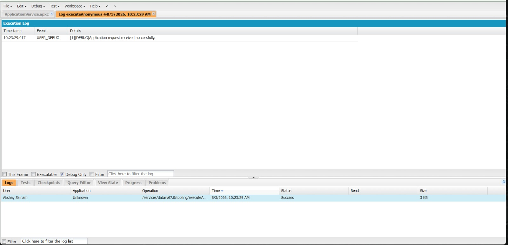
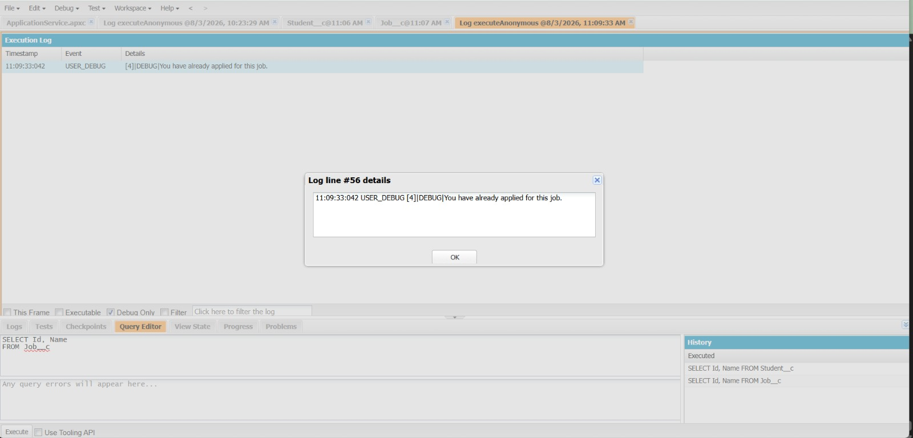

# Engineering Sprint 2 – Receiving an Application


# Sprint Objective

Implement the `submitApplication()` method to receive a student's application request.

At this stage, the method only accepts the required parameters and returns a success message. No business validations are implemented.

---

# Business Requirement

When a student selects a company and clicks **Apply**, the system should receive the application request and begin processing it.

---

# Task Completed

- Created the `submitApplication()` method.
- Accepted Student Id and Job Id as parameters.
- Returned a success message.
- No validation logic added.

---

# Source Code

```apex
public class ApplicationService {

    public static String submitApplication(Id studentId, Id jobId) {

        return 'Application request received successfully.';

    }

}
```

---

# Execute Anonymous

```apex
System.debug(
    ApplicationService.submitApplication(null, null)
);
```

---

# Output

```
Application request received successfully.
```

---

# Screenshots

## ApplicationService Method



---


## Debug Output



---

# Expected Outcome

The application successfully receives the request and returns a confirmation message.

---

# Conclusion

Successfully implemented the `submitApplication()` method to receive application requests, creating the foundation for future validation logic.
