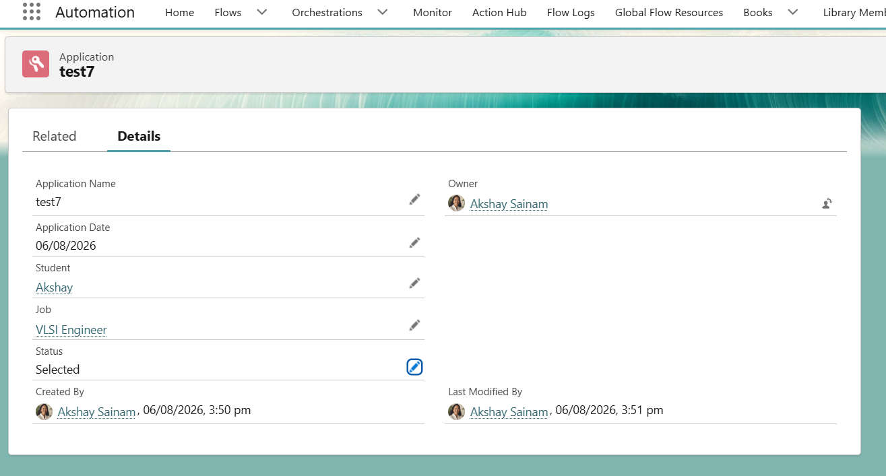
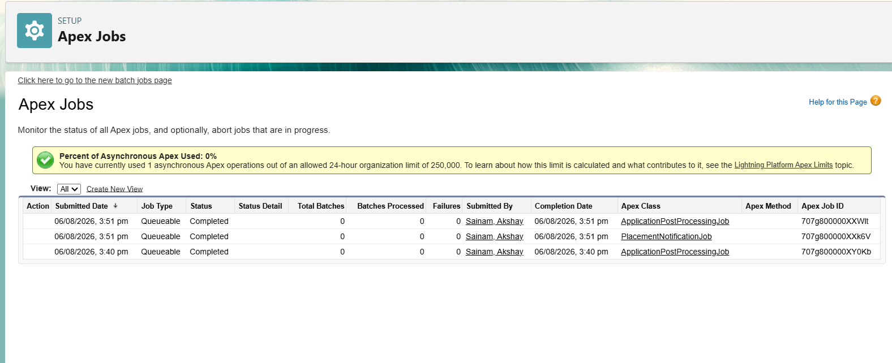
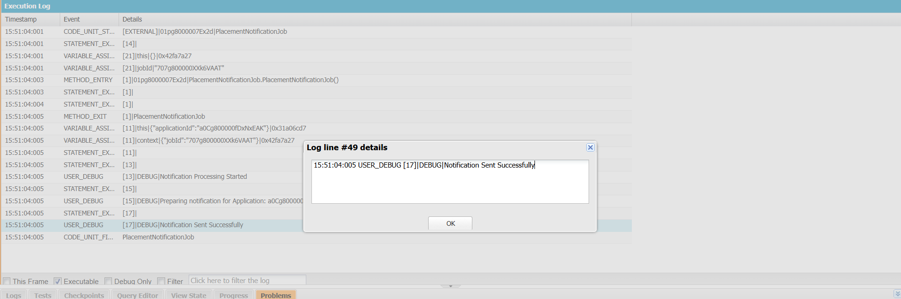

# Engineering Sprint 20 – Designing a Queueable Chain

# Sprint Objective

Design a Queueable chain where one background job performs external synchronization and, upon successful completion, automatically starts a second Queueable job responsible for notification processing.

---

# Business Requirement

When an Application status changes to **Selected**, Salesforce should:

- Complete the essential transaction immediately.
- Queue the first background job for external synchronization.
- After successful synchronization, automatically start a second Queueable job for notification processing.

This approach separates responsibilities and keeps each Queueable class focused on a single task.

---

# Tasks Completed

- Created **ApplicationPostProcessingJob** for external synchronization.
- Created **PlacementNotificationJob** for notification processing.
- Implemented Queueable chaining using `System.enqueueJob()`.
- Maintained clean separation of responsibilities.
- Ensured the second Queueable executes only after the first completes successfully.

---

# Queueable Chain Architecture

```text
Application Selected
        │
        ▼
ApplicationTrigger
        │
        ▼
ApplicationTriggerHandler
        │
        ▼
ApplicationPostProcessingJob
        │
        ▼
External Synchronization
        │
        ▼
System.enqueueJob()
        │
        ▼
PlacementNotificationJob
        │
        ▼
Notification Processing
```

---

# Expected Behaviour

When an Application status changes to **Selected**:

1. Student information is updated immediately.
2. `ApplicationPostProcessingJob` executes.
3. External synchronization is completed.
4. `PlacementNotificationJob` is automatically queued.
5. Notification processing completes successfully.

---

# Screenshots

## Selected Application



---

## Apex Jobs



---

## Debug Log



---

# Engineering Principle

Each Queueable job should have a single responsibility.

When multiple background operations depend on each other, Queueable chaining provides a clean and maintainable solution while keeping responsibilities separated.

---

# Learning Outcome

During this sprint, I learned:

- How Queueable chaining works.
- How one Queueable job can start another Queueable job.
- Why background jobs should have a single responsibility.
- How to design sequential asynchronous workflows.
- How to build scalable asynchronous architectures in Salesforce.

---

# Conclusion

Successfully implemented Queueable chaining for the Placement Management System. External synchronization and notification processing now execute as separate Queueable jobs, resulting in a modular, maintainable, and scalable asynchronous workflow.
