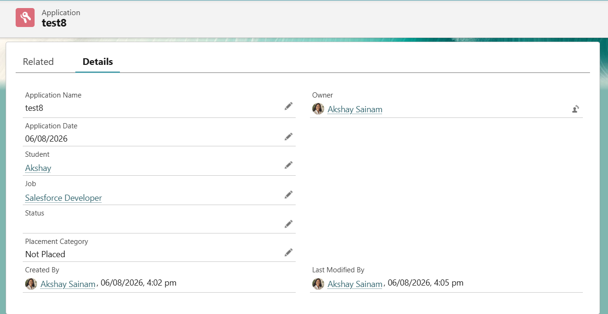
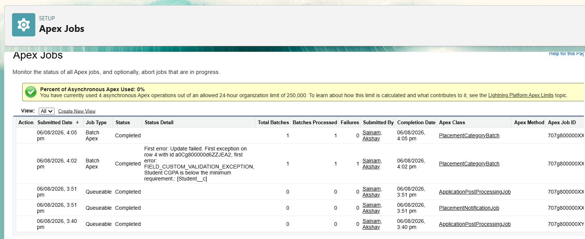

# Engineering Sprint 21 – Processing Historical Applications with Batch Apex

# Sprint Objective

Implement Batch Apex to process a large number of Application records efficiently while following Salesforce bulk processing best practices.

---

# Business Requirement

The Placement Office requires historical Application records to be processed in the background.

For every Application record whose **Placement Category** is empty, the system should calculate and update the field based on the student's placement status.

The solution must support large datasets and process records in manageable batches.

---

# Tasks Completed

- Created `Placement_Category__c` field on `Application__c`.
- Created `PlacementCategoryBatch` implementing `Database.Batchable<SObject>`.
- Implemented the `start()`, `execute()`, and `finish()` methods.
- Queried only Application records where `Placement_Category__c` is null.
- Updated Placement Category in bulk.
- Executed the Batch Apex job using Execute Anonymous.
- Verified the Batch execution through Apex Jobs.

---

# Batch Apex Workflow

```text
Execute Anonymous
        │
        ▼
PlacementCategoryBatch
        │
        ▼
start()
        │
        ▼
Retrieve Applications
        │
        ▼
execute()
        │
        ▼
Update Placement Category
        │
        ▼
finish()
        │
        ▼
Batch Completed
```

---

# Expected Behaviour

The Batch job processes all Application records where **Placement Category** is empty.

After processing:

- Status = Selected → Placement Category = Placed
- Other Status → Placement Category = Not Placed

The Batch executes asynchronously and supports processing large datasets efficiently.

---

# Screenshots

## Batch Result



---

## Apex Jobs



---

# Engineering Principle

Batch Apex should be used when processing large datasets that cannot be handled efficiently within a single transaction.

Each batch executes independently, helping to stay within Salesforce Governor Limits while maintaining scalability.

---

# Learning Outcome

During this sprint, I learned:

- How Batch Apex processes records asynchronously.
- The purpose of the `start()`, `execute()`, and `finish()` methods.
- How Salesforce divides large datasets into smaller execution scopes.
- Why bulk updates should be performed outside loops.
- How to monitor Batch Apex execution using Apex Jobs.

---

# Conclusion

Successfully implemented Batch Apex for processing historical Application records in the Placement Management System. The solution efficiently processes large datasets using the Batch Apex lifecycle (`start`, `execute`, and `finish`) while following Salesforce bulk processing best practices.
