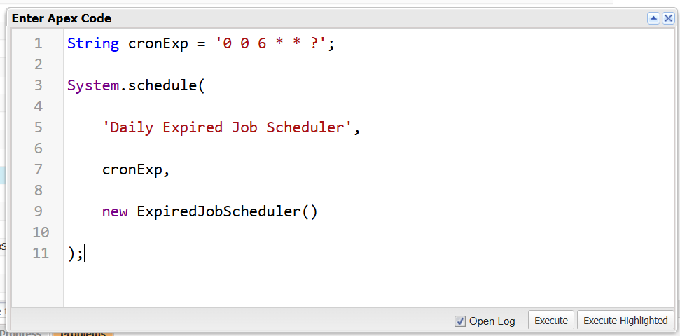
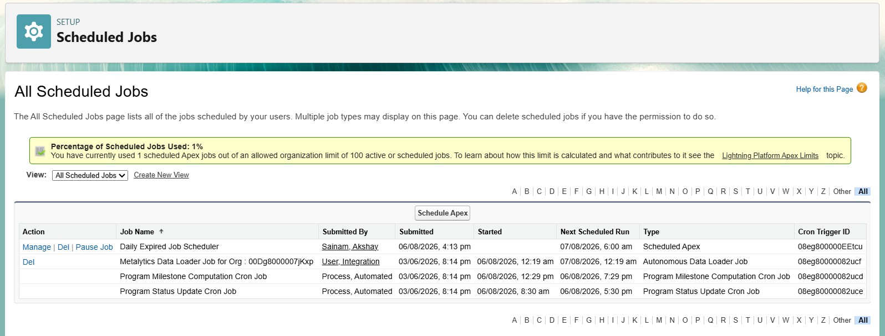
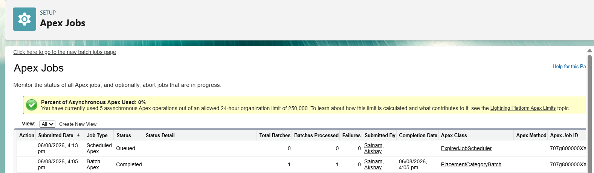

# Engineering Sprint 22 – Scheduling Expired Job Processing

# Sprint Objective

Implement Scheduled Apex to automatically identify expired Job records and process them using Batch Apex at a scheduled time.

---

# Business Requirement

The Placement Office requires the system to automatically close expired Job postings every morning.

Instead of processing all records directly inside the scheduler, the scheduler should initiate a Batch Apex job that processes expired Job records efficiently.

---

# Tasks Completed

- Created `ExpiredJobBatch` implementing `Database.Batchable<SObject>`.
- Queried only expired Job records.
- Updated expired Job records from **Open** to **Closed**.
- Created `ExpiredJobScheduler` implementing the `Schedulable` interface.
- Scheduled the Batch Apex job using `System.schedule()`.
- Verified the scheduled job in Salesforce.
- Verified Batch execution through Apex Jobs.

---

# Architecture

```text
Scheduled Time (6:00 AM)
        │
        ▼
ExpiredJobScheduler
        │
        ▼
Database.executeBatch()
        │
        ▼
ExpiredJobBatch
        │
        ▼
start()
        │
        ▼
Retrieve Expired Jobs
        │
        ▼
execute()
        │
        ▼
Close Expired Jobs
        │
        ▼
finish()
        │
        ▼
Batch Completed
```

---

# Expected Behaviour

Every day at the scheduled time:

- The scheduler automatically starts the Batch Apex job.
- The Batch identifies expired Job records.
- Expired Job records are updated from **Open** to **Closed**.
- The Batch job completes successfully.

---

# Screenshots

## Execute Anonymous



---

## Scheduled Jobs



---

## Apex Jobs



---

# Engineering Principle

Scheduled Apex determines **when** a process should run.

Batch Apex determines **how** a large dataset should be processed.

Separating scheduling logic from processing logic results in a clean, maintainable, and scalable architecture.

---

# Learning Outcome

During this sprint, I learned:

- How Scheduled Apex automates recurring business processes.
- How to implement the `Schedulable` interface.
- How to schedule Apex using `System.schedule()`.
- How Scheduled Apex and Batch Apex work together.
- Why scheduling and processing responsibilities should remain separate.

---

# Conclusion

Successfully implemented Scheduled Apex with Batch Apex for automatically closing expired Job records. The scheduler initiates the Batch job at the configured time, while the Batch processes expired Job records efficiently, following Salesforce best practices for asynchronous processing and clean architecture.
