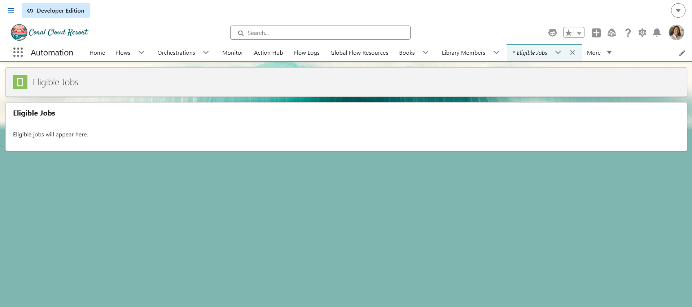
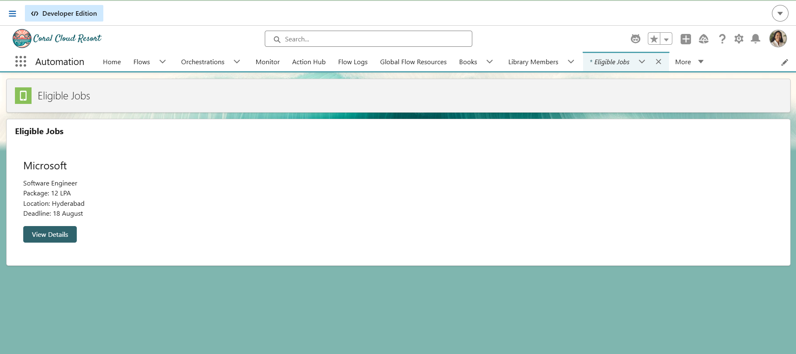
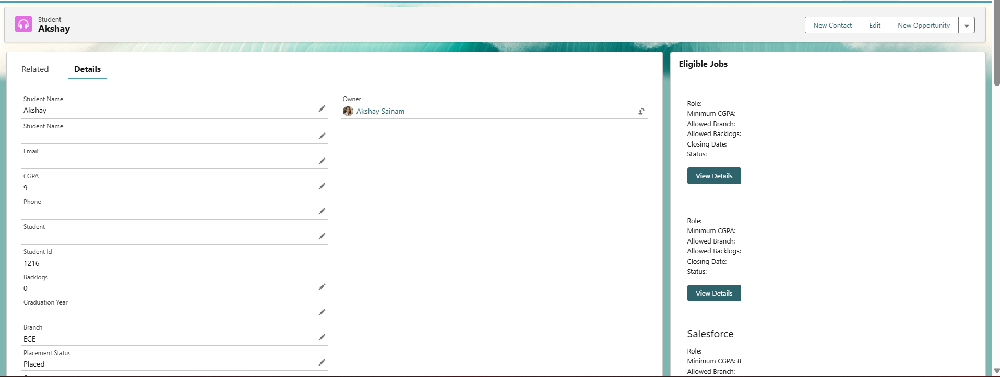
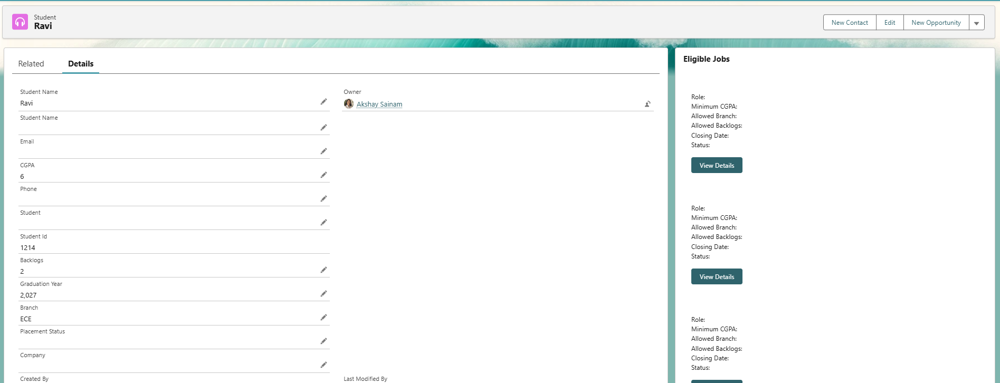

# Engineering Sprint 23 – Build Eligible Jobs V1

# Sprint Objective

Build the first version of an **Eligible Jobs** Lightning Web Component (LWC) that allows students to view job opportunities for which they are eligible.

The component was developed incrementally, starting with a hard-coded job and progressing to real Salesforce data and existing Apex eligibility logic.

---

# Business Requirement

Students should be able to view available job opportunities based on their eligibility.

Eligibility is determined using:

- Student CGPA
- Student Branch
- Student Backlogs
- Job Minimum CGPA
- Job Allowed Branch
- Job Allowed Backlogs

The eligibility rules are handled in the Apex service layer rather than being duplicated inside the Lightning Web Component.

---

# Screenshots

## Stage 1 – LWC Component



---

## Stage 2 – Hard-Coded Job



---

## Stage 3 – JavaScript Data Binding


---

## Stage 4 – Multiple Jobs


---

## Stage 5 – Real Salesforce Job Data



---

## Stage 6 – Eligibility Testing



---

# Learning Outcomes

During this sprint, I learned:

- How to create a Lightning Web Component.
- The purpose of LWC HTML, JavaScript, and metadata files.
- How LWC data binding works.
- How to render multiple records using `for:each`.
- How to retrieve Salesforce data using Apex.
- How to use the LWC wire service.
- How to pass the current record ID to an LWC.
- How to connect an LWC with an Apex controller.
- How to connect an Apex controller with a service layer.
- How to keep business logic outside the UI.
- How to implement CGPA-based eligibility.
- How to implement branch-based eligibility.
- How to implement backlog-based eligibility.
- How to test both eligible and ineligible scenarios.

---

# Conclusion

Sprint 23 successfully delivered the first version of the **Eligible Jobs** Lightning Web Component.

The component evolved from a simple hard-coded interface into a Salesforce-connected component that retrieves Job records and uses the existing Apex business logic to determine student eligibility.

The final implementation follows a layered architecture:

```text
LWC
 ↓
Apex Controller
 ↓
ApplicationService
 ↓
Business Rules
 ↓
Salesforce Data
```

This provides the foundation for the next sprint, where the **Job Application workflow** will be implemented.
