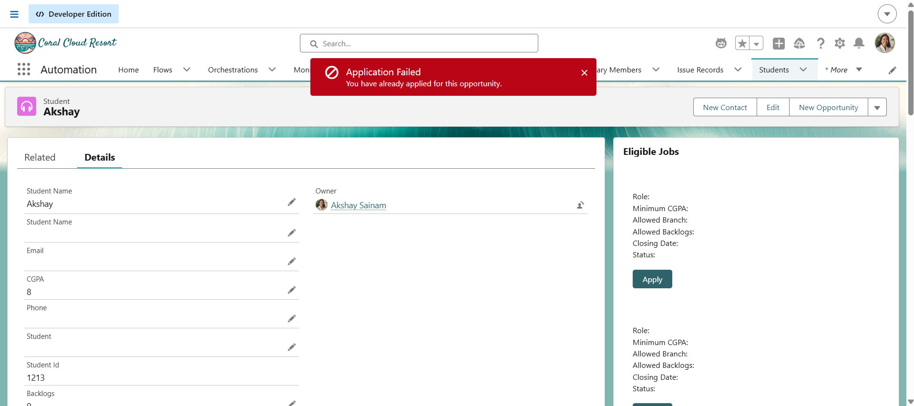
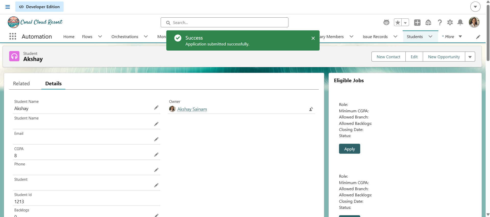

# Engineering Sprint 24 – Apply Workflow

## Sprint Objective

Implemented the job application workflow in the Placement Management System.

Students can select an eligible job from the **Eligible Jobs** LWC and submit an application. The application request is processed through Apex and the existing service layer.

---

## Work Completed

### 1. Apply Functionality

Added an **Apply** button to each eligible job displayed in the `eligibleJobs` LWC.

The selected Job ID is captured using the button's `data-job-id` attribute.

```text
Student
   ↓
Eligible Jobs
   ↓
Apply
   ↓
Selected Job ID
```

---

### 2. Student and Job Identification

The LWC uses the current Student record ID along with the selected Job ID.

The application request therefore contains:

```text
Student ID
Job ID
```

This ensures that the application is associated with the correct student and job.

---

### 3. Imperative Apex

Implemented an imperative Apex call from the LWC because applying for a job is an explicit user action.

The LWC calls:

```text
ApplicationController.submitApplication()
```

The request is passed from the LWC to Apex with the Student ID and Job ID.

---

### 4. Application Controller

Created:

```text
ApplicationController.cls
```

The controller acts as the entry point between the LWC and the service layer.

```text
eligibleJobs LWC
       ↓
ApplicationController
       ↓
ApplicationService
```

The controller does not contain the business eligibility rules.

---

### 5. Application Service

Extended:

```text
ApplicationService.cls
```

with the application submission functionality.

The service:

- Validates Student and Job information.
- Checks whether the application deadline has passed.
- Checks whether the student has already applied for the same job.
- Creates the `Application__c` record.
- Returns the created Application ID.

---

### 6. Application Creation

A successful application creates an `Application__c` record containing:

```text
Student
Job
Application Date
```

The created Application ID was successfully returned to the LWC.

Example successful console result:

```text
Student Id: a0A...
Selected Job Id: a0B...
Application Id: a0C...
```

---

### 7. Deadline Validation

The application service checks the Job closing date before creating an application.

If the closing date has passed, the application is rejected with:

```text
Applications for this job are now closed.
```

This was successfully tested during the sprint.

---

### 8. Duplicate Application Protection

The service checks for an existing application using the combination of:

```text
Student + Job
```

This prevents the same student from submitting another application for the same job.

---

### 9. Success and Error Handling

Added Salesforce toast notifications to the LWC.

Successful submission displays:

```text
Application Submitted
Your application was submitted successfully.
```

Failed submissions display an appropriate error message.

The Apply action also uses a submission state to prevent unnecessary repeated requests while the Apex operation is running.

---

# Screenshots

## Application Created


## Apply Workflow


## Duplicate Application Validation



## Expired Job Validation


## Successful Application



---

## Learning Outcomes

During this sprint, I learned:

- How to implement an Apply workflow using LWC.
- How to capture a selected record ID from an LWC button.
- How to use `data-*` attributes in LWC.
- How to pass parameters from LWC to Apex.
- When to use imperative Apex calls.
- How to create an Apex controller for an LWC.
- How to separate controller logic from business logic.
- How to extend an Apex service class with reusable application logic.
- How to create `Application__c` records using Apex.
- How to perform duplicate-record checks.
- How to validate application deadlines.
- How to handle Apex errors in LWC.
- How to display Salesforce toast notifications.
- How to prevent repeated submissions while a request is processing.
- How to test both successful and failed application scenarios.

---

## Sprint Completion

Sprint 24 successfully implemented the core **Job Application Workflow**, allowing a student to apply for a job directly from the Eligible Jobs Lightning Web Component and create a corresponding `Application__c` record in Salesforce.
