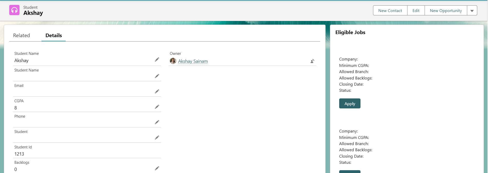
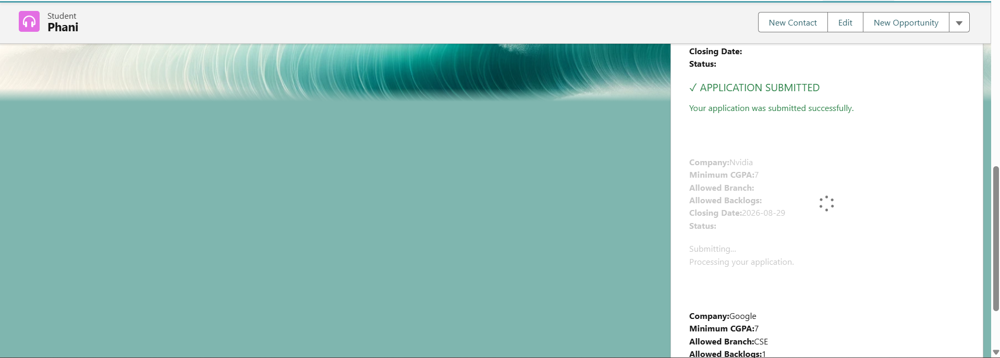
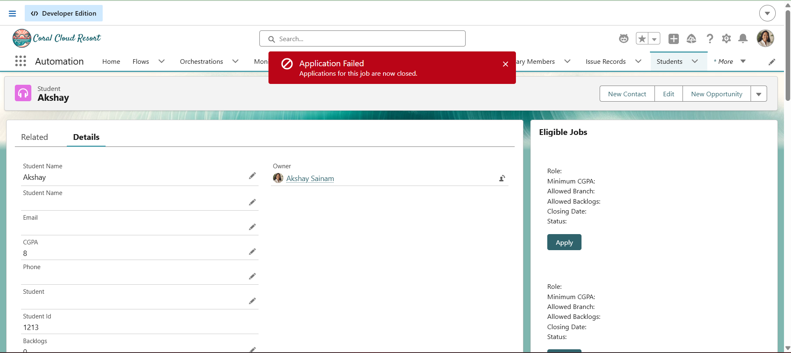

# Engineering Sprint 25 – Four Apply States

## Sprint Objective

Implemented a clear four-state user experience for the job application process.

The Apply workflow now provides immediate feedback to the student while the application is being processed and gives clear success or failure information after the request is completed.

---

## Work Completed

### 1. Ready State

Implemented the initial state of the Apply action.

The student can see the:

```text
Apply
```

button when no application request is currently being processed.

---

### 2. Submitting State

Implemented a dedicated submitting state after the student clicks Apply.

The interface displays:

```text
Submitting...
Processing your application.
```

A loading spinner is also displayed while the Apex request is being processed.

This prevents the user from being left without feedback during server processing.

---

### 3. Success State

Implemented a success state after a valid application is successfully created.

The component displays:

```text
✓ APPLICATION SUBMITTED
```

along with a confirmation message.

A Salesforce success toast is also displayed.

The successful flow creates the corresponding `Application__c` record through the existing Apex application service.

---

### 4. Failure State

Implemented a user-friendly failure state when the application cannot be submitted.

The component displays:

```text
Application could not be submitted.
```

followed by the actual business error message.

Examples tested include:

```text
Applications for this job are now closed.
```

and:

```text
You have already applied for this opportunity.
```

Technical Apex errors are not directly exposed to the user.

---

## Screenshots

### Ready State



### Submitting State



### Success State


### Failure State



---

## Learning Outcomes

During this sprint, I learned:

- How to design multiple UI states for a single user action.
- How to provide immediate feedback during asynchronous Apex operations.
- How to display loading indicators in LWC.
- How to manage submitting, success, and failure states.
- How to maintain state independently for individual job records.
- How to handle errors returned from Apex.
- How to convert backend errors into useful user-facing messages.
- How to prevent unnecessary repeated application submissions while processing.
- How to use conditional rendering in LWC.
- How to improve user experience when working with asynchronous server requests.
- How to deliberately test different application outcomes.

---

## Sprint Completion

Sprint 25 successfully implemented the **Four Apply States**:

```text
READY
   ↓
SUBMITTING
   ↓
SUCCESS / FAILURE
```

The application workflow now provides clear feedback throughout the entire job application process.
