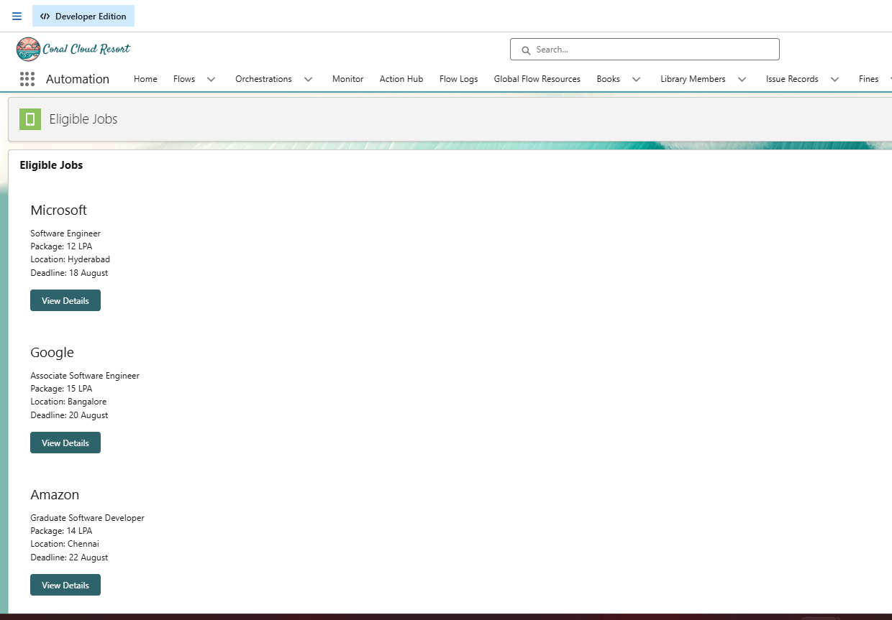
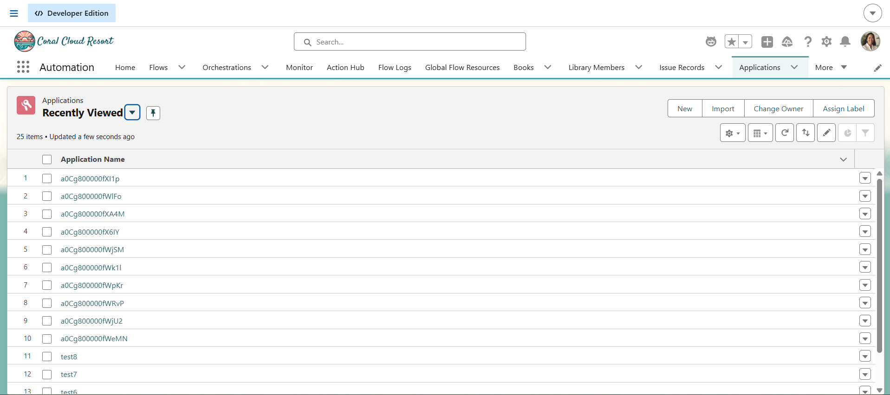

# Sprint 26 — LWC Parent-Child Component Architecture

## Overview

Sprint 26 focused on refactoring the Eligible Jobs Lightning Web Component into a cleaner parent-child component architecture.

The existing `EligibleJobs` component was responsible for displaying job information and handling the application interaction. In this sprint, the job display was separated into a reusable `JobCard` child component.

The main objective was to establish clear component responsibilities and implement proper communication between the parent and child components.

---

## Objectives

- Separate the job display into a reusable child component.
- Establish clear responsibilities between parent and child components.
- Implement Parent-to-Child communication.
- Implement Child-to-Parent communication.
- Use `@api` for passing job information to the child.
- Use `CustomEvent` for sending the Apply action back to the parent.
- Keep business logic in the Apex layer.
- Maintain loading, success, and failure states.
- Avoid unnecessary duplicate data retrieval.
- Create a cleaner and more maintainable LWC architecture.

---

## Components

### Parent Component — EligibleJobs

The `EligibleJobs` component is responsible for:

- Retrieving eligible jobs from Apex.
- Maintaining the list of jobs.
- Maintaining overall UI state.
- Passing individual job records to `JobCard`.
- Receiving Apply events from child components.
- Identifying the selected Job Id.
- Calling the Apex application submission method.
- Handling success and failure responses.
- Displaying appropriate user feedback.

### Child Component — JobCard

The `JobCard` component represents an individual job.

It is responsible for:

- Receiving job information from the parent.
- Displaying job information.
- Displaying the Apply button.
- Handling the user's Apply interaction.
- Sending the selected Job Id back to the parent.

---

## Component Structure

EligibleJobs is the parent component and contains multiple reusable JobCard child components.

EligibleJobs
- JobCard
- JobCard
- JobCard

---

## Screenshots

### 1. Eligible Jobs — Parent and Child Components

Shows the Eligible Jobs page with multiple Job Cards displayed.

---

### 2. Application Loading State

Shows the Job Card while the application is being submitted.

---

### 3. Successful Application

Shows the successful application submission message/toast.

---

### 4. Application Record

Shows the Application record created successfully in Salesforce.

---

## Learning Outcomes

After completing Sprint 26, I learned:

- How to divide a large LWC into smaller reusable components.
- How to identify parent and child responsibilities.
- How to pass data from a parent component to a child using `@api`.
- How to communicate from a child component to a parent using `CustomEvent`.
- How to handle events in a parent LWC.
- How to maintain component state during asynchronous operations.
- How to implement loading, success, and failure states.
- How to keep business logic outside the UI.
- How to integrate reusable LWC components with Apex.
- How component separation improves readability and maintainability.
- How to avoid unnecessary duplicate data retrieval.
- How to design a clearer and more scalable LWC architecture.

---

## Key Takeaway

The main concept learned in Sprint 26 is:

Parent to Child:
`@api`

Child to Parent:
`CustomEvent`

The parent coordinates the overall process, while the child focuses on the individual UI element.

This creates a cleaner, reusable, and maintainable Lightning Web Component architecture.
