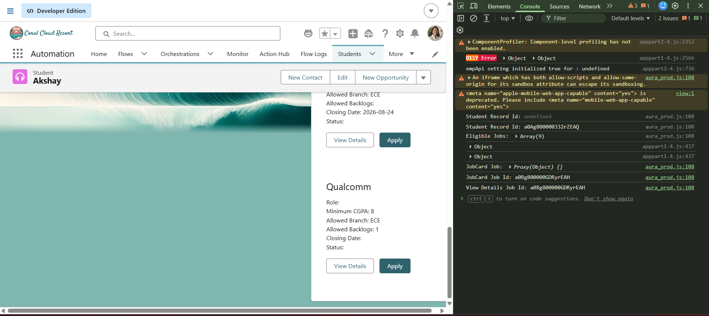
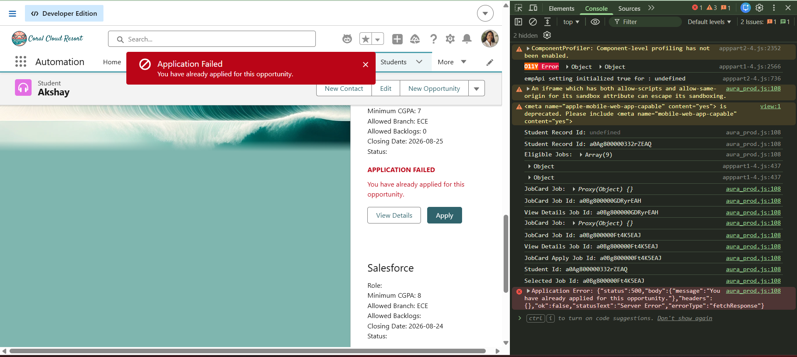

# Sprint 27 — JobCard to Parent Communication

## Overview

Sprint 27 focused on implementing communication between the `JobCard` child Lightning Web Component and the `EligibleJobs` parent component.

The child component communicates user actions to the parent using `CustomEvent`, while the parent component handles the events and coordinates the required behaviour.

The two required events implemented in this sprint are:

- `viewdetails`
- `apply`

---

## Objectives

- Implement Child-to-Parent communication in LWC.
- Use `CustomEvent` to communicate user actions.
- Pass the Job Id through `event.detail`.
- Handle the `viewdetails` event in the parent.
- Handle the `apply` event in the parent.
- Keep the child component independent of parent state.
- Maintain the existing application submission functionality.
- Handle application success and failure responses.

---

## Screenshots

### 1. View Details Event

Shows the JobCard sending the Job Id and the parent receiving it.

---

### 2. Apply Event and Duplicate Application Handling

Shows the Apply event, Student Id, Selected Job Id, and the duplicate application error.

---

## Learning Outcomes

After completing Sprint 27, I learned:

- How Parent-to-Child communication works in Lightning Web Components.
- How to use `@api` to pass data from a parent to a child.
- How Child-to-Parent communication works using `CustomEvent`.
- How to create custom events in an LWC.
- How to pass data through `event.detail`.
- How the parent listens for custom events.
- How to handle different events using separate parent methods.
- How to keep child components independent from parent state.
- How to create reusable child components.
- How to maintain separation of responsibilities between components.
- How LWC components communicate without directly modifying each other's state.
- How to debug LWC event communication using browser Developer Tools.
- How existing Apex application logic can continue working with the new component architecture.

---

## Key Takeaway

The main concept learned in Sprint 27 is:

    Parent → Child
    @api

    Child → Parent
    CustomEvent

The child reports the user's action, while the parent coordinates the behaviour.

This provides a cleaner and more maintainable architecture for Lightning Web Components.
