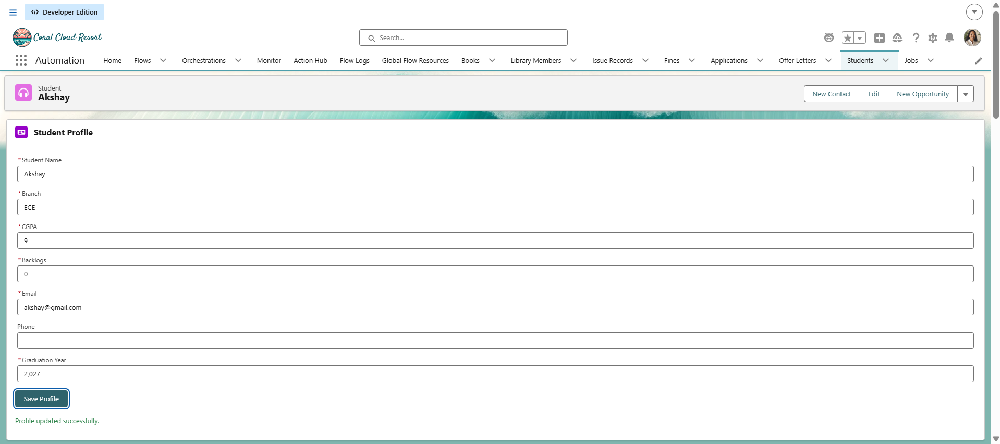
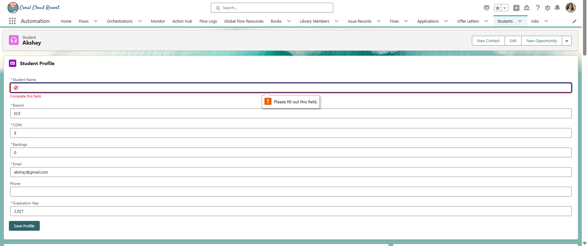

# Sprint 28 — Student Profile Form

## Overview

Sprint 28 focused on building a Student Profile Form using Lightning Web Components (LWC) and Lightning Data Service (LDS).

The component allows users to view and update student profile information directly from the Student record page.

The implementation uses `lightning-record-edit-form` and `lightning-input-field` to load and update Salesforce records without unnecessary Apex code.

---

## Objectives

- Build a Student Profile Form using LWC
- Load existing Student record information
- Allow users to edit profile information
- Validate required fields
- Save updated information
- Display success messages
- Handle update errors
- Use Lightning Data Service
- Integrate the component with the Student record page

---

## Screenshots

### Screenshot 1 — Successful Profile Update

Shows the updated profile and successful update message.

### Screenshot 2 — Required Field Validation

Shows the validation message when a required field is left empty.

---

## Learning Outcomes

After completing Sprint 28, I learned:

- How to build forms using Lightning Web Components
- How to use `lightning-record-edit-form`
- How to use `lightning-input-field`
- How Lightning Data Service works
- How to use `@api recordId`
- How Salesforce provides the current record Id
- How to handle the `onsuccess` event
- How to handle the `onerror` event
- How required-field validation works
- How to update Salesforce records without custom Apex
- When to use Lightning Data Service instead of Apex
- How to provide success and error feedback to users
- How to integrate an LWC into a Salesforce record page

---
