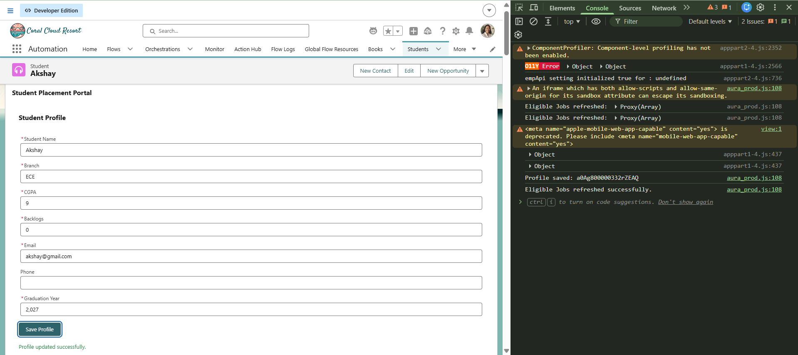
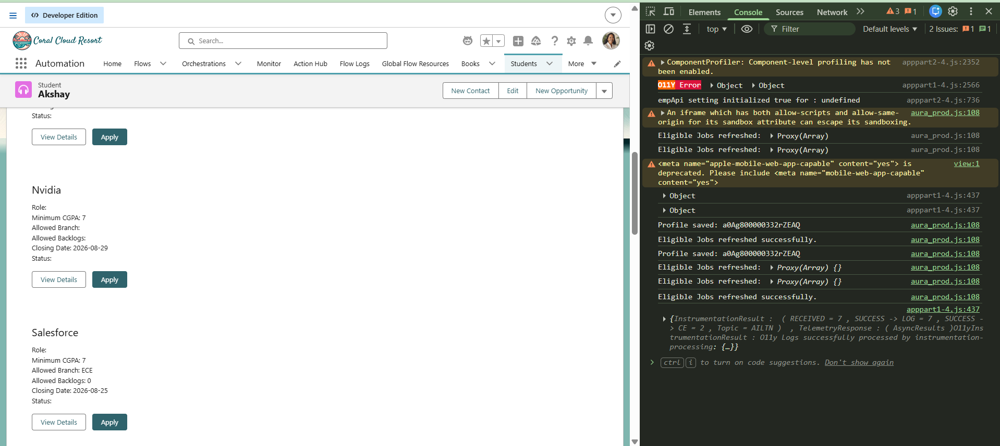

# Sprint 29 — Consistent Student Experience

## Overview

Sprint 29 focused on keeping multiple Lightning Web Components (LWC) synchronized when Student information changes.

The main requirement was to ensure that when a student updates their profile, dependent components such as Eligible Jobs refresh and display the latest information.

The implementation uses a parent component, custom events, and `refreshApex()` to coordinate the components.

---

## Objective

The main objective of Sprint 29 was to maintain a consistent user experience across different components.

For example:

```text
Student Profile
      ↓
Student record updated
      ↓
Profile Saved Event
      ↓
Parent Component
      ↓
Refresh Eligible Jobs
      ↓
Latest eligibility displayed
```

---

## Problem

Multiple components depend on the same Student information.

For example:

```text
Student Profile
       ↓
     CGPA

Eligible Jobs
       ↓
Uses CGPA for eligibility
```

If the student changes their CGPA, the Eligible Jobs component must use the updated value.

Without refreshing the dependent data, the UI could display outdated job eligibility information.

---

## Screenshots

### Screenshot 1 — Student Profile and Refresh

Shows the Student Profile component after successfully saving the profile and the console logs confirming the profile save and Eligible Jobs refresh.



---

### Screenshot 2 — Updated Eligible Jobs

Shows the Eligible Jobs list after changing the Student CGPA to 7.

The displayed jobs reflect the updated eligibility criteria.



---

## Learning Outcomes

After completing Sprint 29, I learned:

- How multiple LWCs can communicate with each other
- How parent-child component architecture works
- How to create and dispatch custom events
- How child components communicate changes to parent components
- How parents coordinate behaviour between child components
- How to use `@api` methods
- How to expose a public method from an LWC
- How `refreshApex()` works
- How to refresh wired Apex data
- How stale UI data can occur
- How to keep dependent components synchronized
- How to design components around data ownership
- How to build a consistent user experience across multiple LWCs

---
