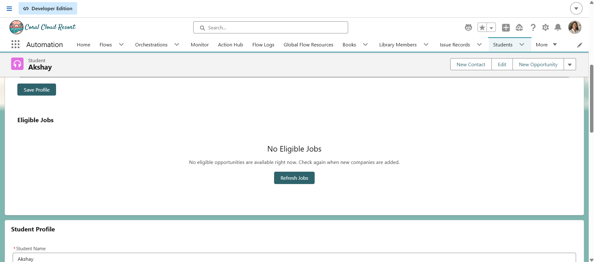
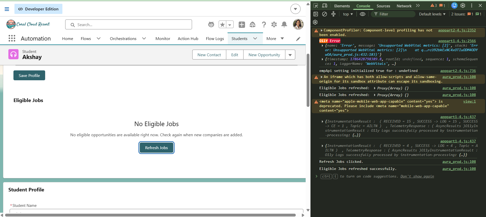

# Sprint 30 — Reusable Empty State

## Overview

Sprint 30 focused on building a reusable Empty State Lightning Web Component (LWC).

The Empty State component is designed to display a consistent message when a component has no data to show.

The component accepts a title, message, and optional action label. It can also notify the parent component when the optional action button is clicked.

---

## Objective

The main objective of Sprint 30 was to create a reusable Empty State component that can be used by different parts of the Placement Management System.

The component supports:

- Custom title
- Custom message
- Optional action button
- Custom event when the action is clicked
- Reusable design across different LWCs

---

## Screenshots

### Screenshot 1 — Empty State

Shows the reusable Empty State component when no eligible jobs are available.

---

### Screenshot 2 — Refresh

Shows the result of clicking the action button and the refresh operation.

---

## Learning Outcomes

After completing Sprint 30, I learned:

- How to create reusable Lightning Web Components
- How to use `@api` properties
- How a parent component passes data to a child component
- How to conditionally display an element using `if:true`
- How to conditionally display an action button
- How to create and dispatch custom events
- How child components communicate with parent components
- How to reuse the same component in multiple places
- How to combine reusable components with existing LWCs
- How to use `refreshApex()` for refreshing wired data
- How to create consistent empty states across an application
