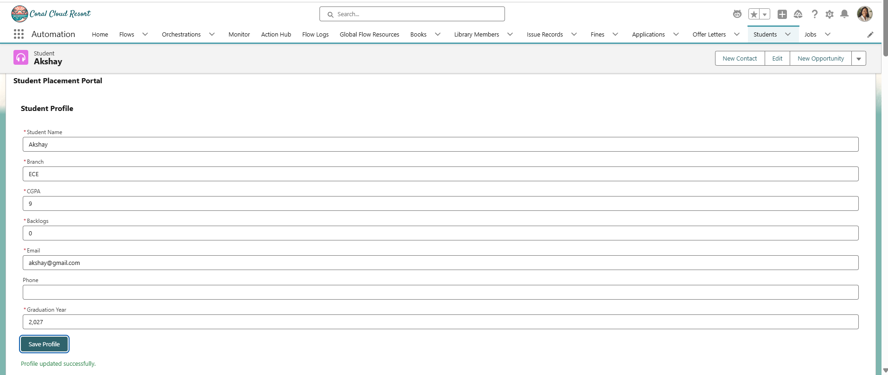
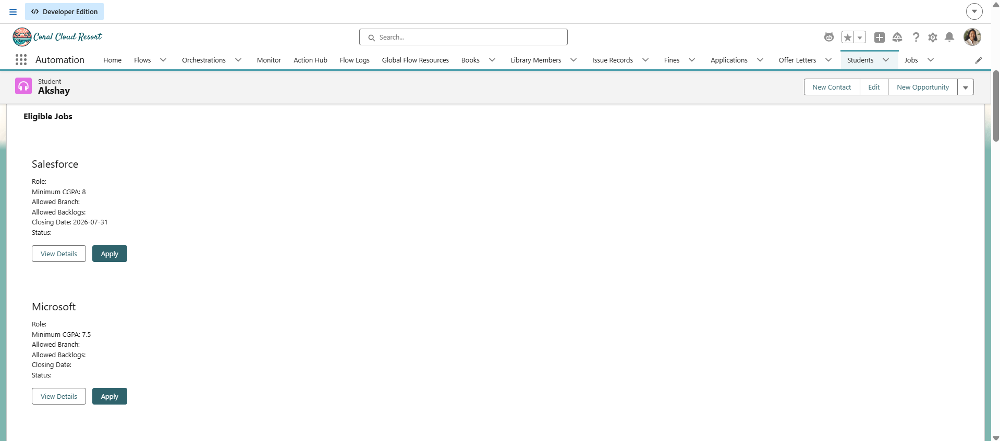
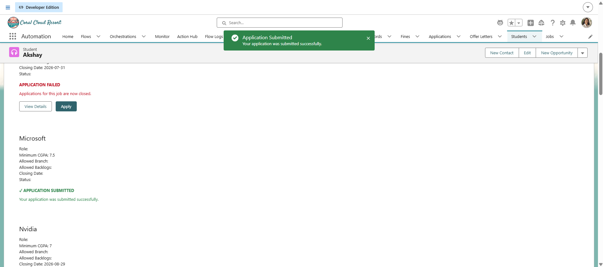
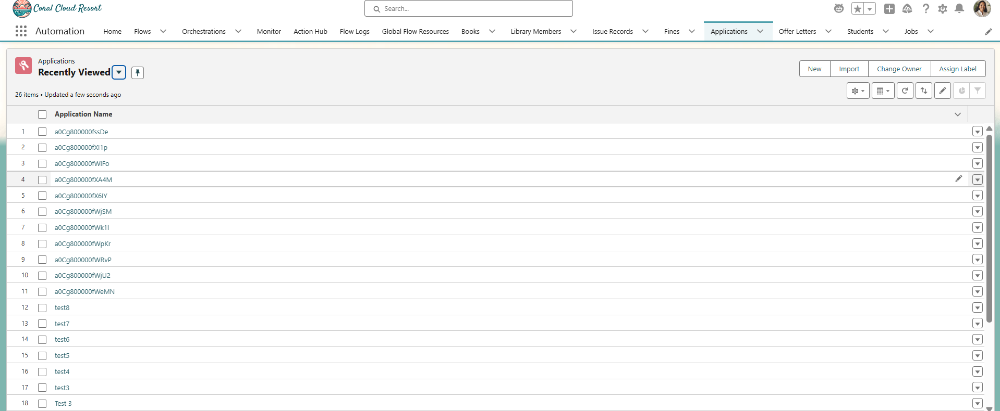

# Sprint 31 — Final Integration Challenge

## Overview

Sprint 31 focused on integrating the major components of the Student Placement Portal into one complete application workflow.

Instead of treating each Lightning Web Component as an isolated coding exercise, this sprint connected the components and verified the complete student journey.

The final workflow is:

```text
Student Login
      ↓
Student Summary
      ↓
Update Profile
      ↓
Profile Saved
      ↓
Eligible Jobs Refresh
      ↓
Select Job
      ↓
Job Details
      ↓
Apply
      ↓
Application Created
      ↓
My Applications Refresh
      ↓
Student Sees New Status
```

---

## Objectives

The main objectives of Sprint 31 were:

- Integrate the major LWC components
- Implement parent-child communication
- Use custom events
- Use data binding
- Handle profile form updates
- Use Lightning Data Service where appropriate
- Use imperative Apex where appropriate
- Maintain server-side business validation
- Handle loading states
- Handle empty states
- Handle error states
- Display successful updates
- Refresh dependent data appropriately
- Maintain clear component responsibilities
- Verify the complete application workflow

---

## Screenshots

### Screenshot 1 — Student Profile

Shows the Student profile and current information.



---

### Screenshot 2 — Profile Update

Shows the successful Student profile update.


---

### Screenshot 3 — Eligible Jobs

Shows Eligible Jobs after the Student profile has been updated.



---

### Screenshot 4 — Application Success

Shows the successful application submission.



---

### Screenshot 5 — My Applications

Shows the newly created application and its current status.



---

### Screenshot 6 — Empty State

Shows the reusable Empty State component.


---

## Learning Outcomes

After completing Sprint 31, I learned:

- How to integrate multiple LWCs into one application workflow
- How parent-child communication works
- How custom events are used in LWC
- How parents pass information to children
- How children communicate actions to parents
- How to use data binding
- When to use Lightning Data Service
- When to use wired Apex
- When to use imperative Apex
- How to refresh dependent data
- How to maintain server-side business validation
- How to design loading states
- How to design meaningful empty states
- How to handle errors professionally
- How to create reusable components
- How to define clear component responsibilities
- How to debug stale UI data
- How to design an end-to-end Salesforce application workflow
