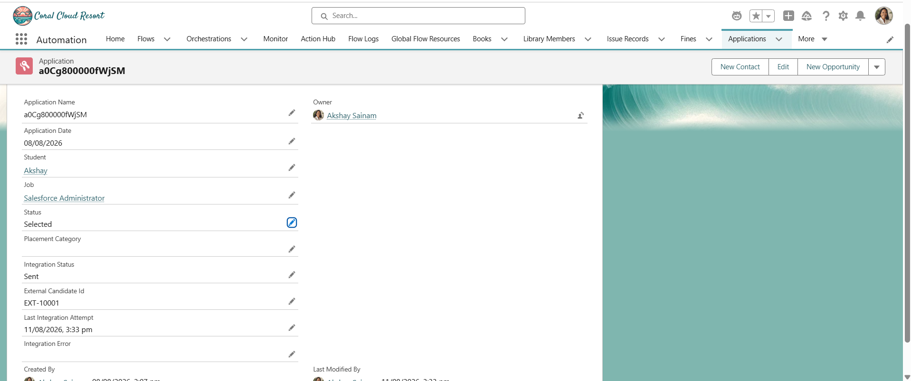
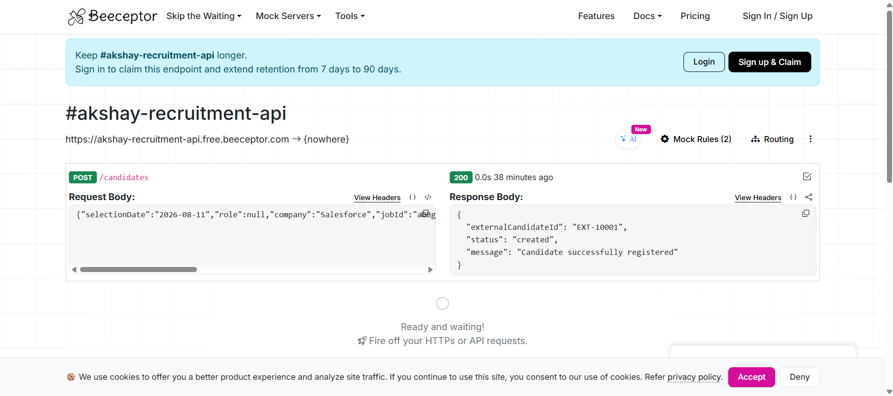

# Sprint 32 — External Recruitment API Integration

## Overview

Sprint 32 focused on integrating the Salesforce Placement Management System with an external recruitment platform.

When a student's Application status changes to **Selected**, Salesforce automatically sends the selected candidate's information to an external recruitment API.

The integration uses:

- Apex Trigger
- Apex Trigger Handler
- Queueable Apex
- HTTP Callouts
- Named Credential
- External Credential
- Permission Set
- Mock REST API using Beeceptor
- Retry handling
- Idempotency using Application Id
- Integration status tracking

The integration was designed to run asynchronously so that the Application update process is not blocked by the external API call.

---

## Objectives

- Integrate Salesforce with an external recruitment API
- Automatically synchronize selected candidates
- Use Queueable Apex for asynchronous processing
- Perform HTTP POST callouts
- Use Named Credentials instead of hard-coding API URLs
- Use External Credentials for authentication configuration
- Handle successful API responses
- Handle client-side errors
- Handle server-side errors
- Implement retry handling
- Prevent uncontrolled retry loops
- Implement idempotency using Application Id
- Store external candidate identifiers
- Track integration status
- Track integration errors
- Track the last integration attempt
- Test the complete integration flow

---

## Screenshots

### Screenshot 1 — Successful Integration

### Screenshot 2 — Beeceptor API Request

---

# Conclusion

Sprint 32 completed the external integration layer of the Salesforce Placement Management System.

The system now supports:

Selected Application  
↓  
Automatic Integration  
↓  
External Recruitment API  
↓  
Candidate Registration  
↓  
External Candidate ID  
↓  
Integration Status  
↓  
Success / Retry / Failure Tracking

This demonstrates how Salesforce can securely and asynchronously communicate with an external recruitment platform using Apex, Queueable Apex, Named Credentials, External Credentials, HTTP Callouts, retry handling, and idempotency.
