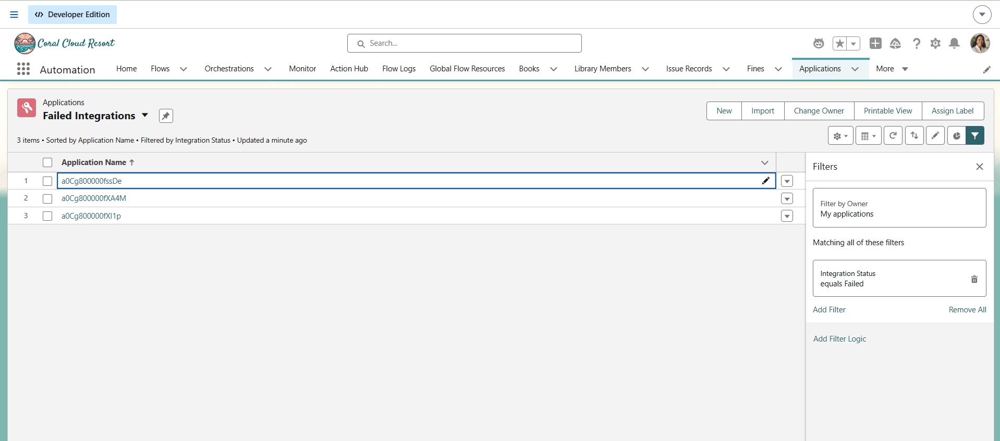
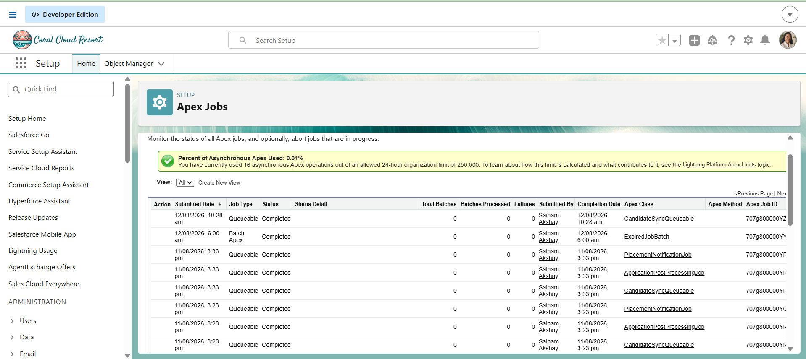
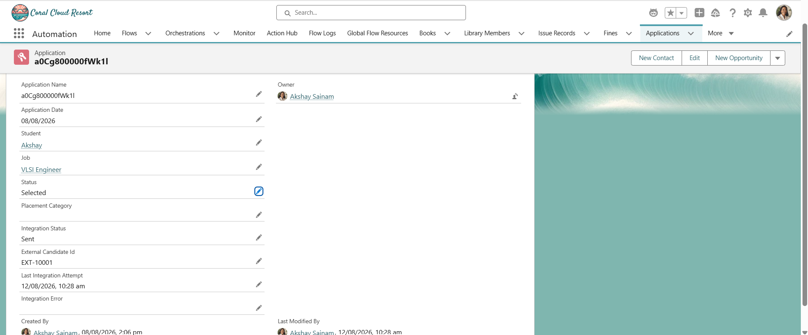

# Sprint 33 — Integration Reliability Challenge

## Overview

Sprint 33 extends the external recruitment integration developed in Sprint 32.

The objective of this sprint is to make the Candidate Sync integration reliable when communicating with an external recruitment system.

The system must:

- Track integration status
- Store the external candidate reference
- Record the last integration attempt
- Record integration errors
- Handle successful and failed API responses
- Support retry processing for temporary failures
- Prevent duplicate candidate submissions
- Allow administrators to identify failed integrations
- Document the API contract and integration architecture

---

# Business Problem

When a student is selected for a job, the Placement Management System must send the student's candidate information to an external recruitment platform.

The Salesforce transaction and the external recruitment system are separate systems.

Therefore:

Salesforce business success does not automatically mean external integration success.

The system must track the external synchronization separately so that administrators know whether a selected candidate was successfully sent, requires a retry, or failed permanently.

---

## Screenshots

### 1. Failed Integrations

### 2. Apex Jobs

### 3. Successful Integration

---

# External System

A mock REST API was used for this project instead of a real recruitment platform.

The mock API was created using Beeceptor.

Base URL:

https://akshay-recruitment-api.free.beeceptor.com

Endpoint:

POST /candidates

Complete endpoint:

https://akshay-recruitment-api.free.beeceptor.com/candidates

The mock API allows the Salesforce integration to be tested without depending on a production recruitment platform.

---

# Key Learning

The most important lesson from Sprint 33 is that integration engineering is not simply about sending an HTTP request.

A reliable integration must consider:

- Authentication
- API contracts
- Errors
- Retries
- Duplicates
- Idempotency
- Monitoring
- Logging
- Asynchronous processing
- Failure recovery

The external system is outside Salesforce's control, so the integration must be designed for situations where the external service is slow, unavailable, incorrectly configured, overloaded, or returns unexpected responses.

---

# Sprint Status

**Sprint 33 — Completed**

The Placement Management System can now send selected candidates to the external recruitment platform while tracking integration state, handling temporary failures, preventing duplicate submissions, recording errors, and providing administrators with visibility into failed integrations.
