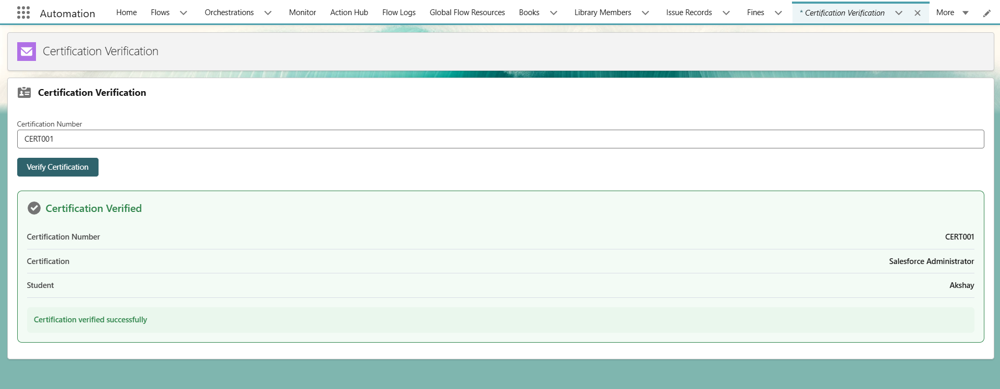
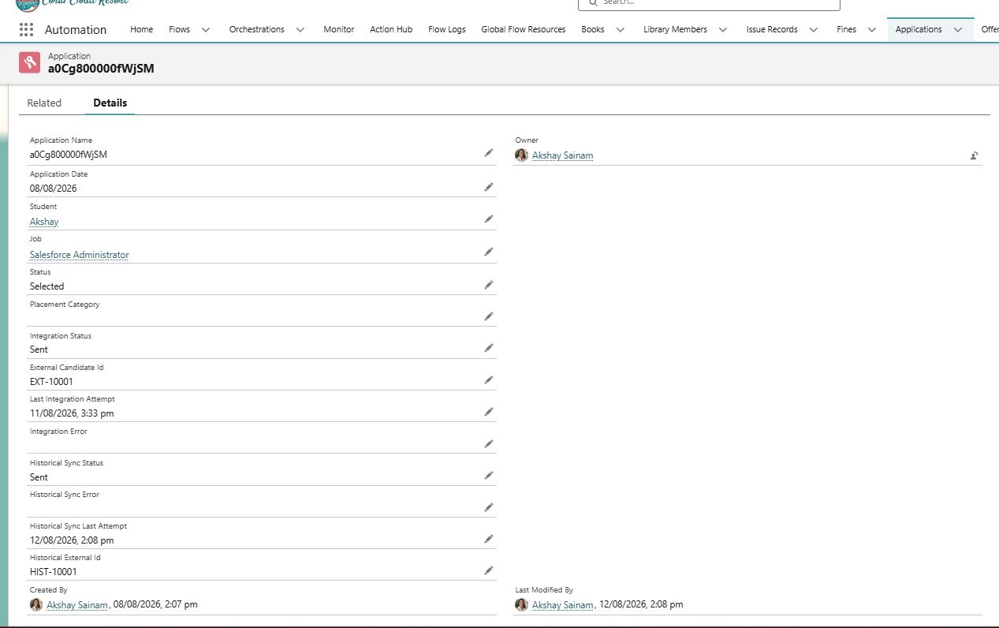
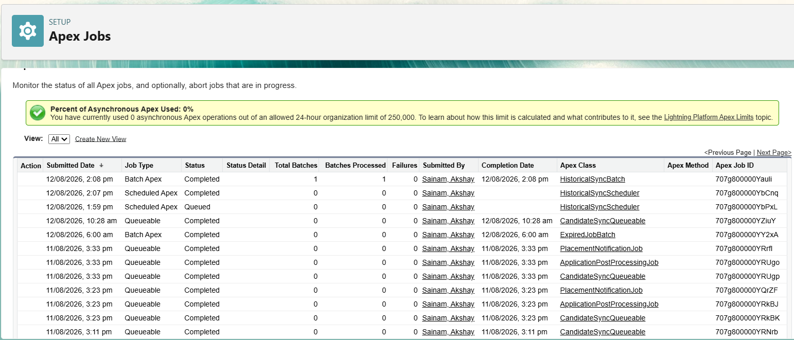

# Sprint 34 — Integration Architecture

## Overview

Sprint 34 focuses on implementing different Salesforce integration patterns based on business requirements.

## Integration A — Certification Verification

A student enters a certification number and Salesforce verifies it using an external API.

### Flow

LWC → Apex → External API → LWC

### Implemented

- Lightning Web Component
- Apex callout service
- Named Credential
- External Credential
- Mock API using Beeceptor
- Success and error handling

## Integration B — Candidate Synchronization

When an Application becomes Selected, candidate information is synchronized with the external recruitment system.

### Flow

Trigger → Queueable Apex → External API

This integration was implemented in previous sprints and reused here.

## Integration C — Historical Synchronization

Historical Application records are synchronized with an external system using asynchronous processing.

### Flow

Scheduled Apex → Batch Apex → External API

### Implemented

- Scheduled Apex
- Batch Apex
- External API callout
- Error handling
- Retry processing
- Synchronization status tracking
- External ID tracking

## Testing

### Certification Verification

Tested with:

`CERT001`

Result:

`Certification Verified`

### Historical Synchronization

Verified:

`Historical Sync Status = Sent`

`Historical External Id = HIST-10001`

`Historical Sync Last Attempt = Populated`

`Historical Sync Error = Blank`

## Screenshots

### Certification Verification

### Historical Synchronization

### Batch Job

## Learning Outcomes

By the end of this sprint, I learned to:

- Understand APIs and REST integration.
- Work with HTTP requests, responses and JSON.
- Perform Salesforce HTTP callouts.
- Use Named Credentials and External Credentials.
- Choose synchronous vs asynchronous integration.
- Use Queueable Apex for background integrations.
- Use Scheduled Apex and Batch Apex for large-volume processing.
- Handle integration failures and retries.
- Understand idempotency and duplicate prevention.
- Design and document integration architecture.
