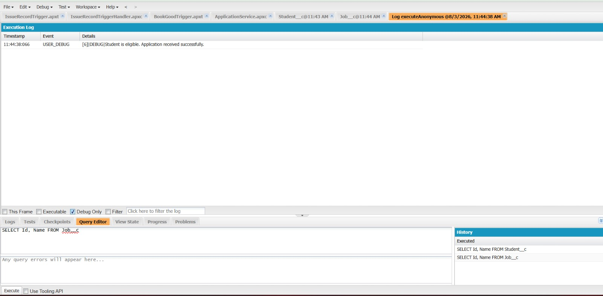

# Engineering Sprint 4 – Student Eligibility Validation


# Sprint Objective

Extend the `submitApplication()` method by implementing student eligibility validation before allowing an application to proceed.

---

# Business Requirement

Before accepting an application, the system should verify whether the student satisfies the company's eligibility criteria.

For this implementation, eligibility is determined by comparing the student's CGPA with the job's minimum CGPA.

---

# Task Completed

- Retrieved Student details using SOQL.
- Retrieved Job details using SOQL.
- Compared Student CGPA with Job Minimum CGPA.
- Displayed an eligibility message based on the validation result.

---

# Source Code

```apex
public class ApplicationService {

    public static String submitApplication(Id studentId, Id jobId) {

        List<Application__c> existingApplications = [
            SELECT Id
            FROM Application__c
            WHERE Student__c = :studentId
            AND Job__c = :jobId
            LIMIT 1
        ];

        if (!existingApplications.isEmpty()) {
            return 'You have already applied for this job.';
        }

        Student__c student = [
            SELECT CGPA__c
            FROM Student__c
            WHERE Id = :studentId
        ];

        Job__c job = [
            SELECT Minimum_CGPA__c
            FROM Job__c
            WHERE Id = :jobId
        ];

        if(student.CGPA__c < job.Minimum_CGPA__c){
            return 'Student is not eligible due to low CGPA.';
        }

        return 'Student is eligible.';
    }

}
```

---

# Execute Anonymous

```apex
Id studentId='YOUR_STUDENT_ID';
Id jobId='YOUR_JOB_ID';

System.debug(
ApplicationService.submitApplication(studentId,jobId)
);
```

---

# Expected Results

| Scenario | Expected Output |
|----------|-----------------|
| Student CGPA < Minimum CGPA | Student is not eligible due to low CGPA. |
| Student CGPA ≥ Minimum CGPA | Student is eligible. |

---

# Screenshots


## Debug Output


R


# Learning Outcome

During this sprint I learned:

- Retrieving related records using SOQL.
- Comparing field values from different objects.
- Implementing business validation in Apex.
- Returning meaningful validation messages.

---

# Conclusion

Successfully implemented eligibility validation by comparing the student's CGPA with the minimum CGPA required for the selected job. This ensures that only eligible students can proceed with the application process.
