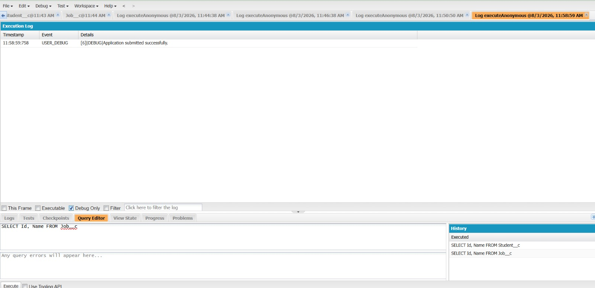
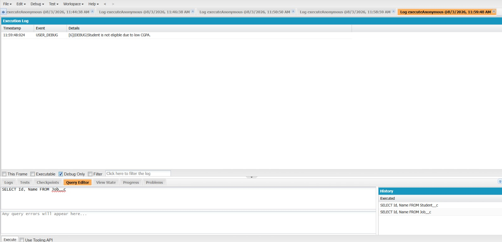

# Engineering Sprint 5 – Save Application Using DML

# Sprint Objective

Extend the `submitApplication()` method to save the application into Salesforce after all validations are completed successfully.

---

# Business Requirement

If the student passes all validation checks, the system should create an `Application__c` record and save it to Salesforce. If the save operation fails, an appropriate error message should be displayed.

---

# Task Completed

- Created an `Application__c` record.
- Assigned Student, Job, and Application Date values.
- Saved the record using DML (`insert`).
- Used `try-catch` to handle DML exceptions.
- Returned success or failure messages.

---

# Source Code

```apex
public class ApplicationService {

    public static String submitApplication(Id studentId, Id jobId) {

        List<Application__c> existingApplications = [
            SELECT Id
            FROM Application__c
            WHERE Student__c = :studentId
            AND Job__c = :jobId
            LIMIT 1
        ];

        if (!existingApplications.isEmpty()) {
            return 'You have already applied for this job.';
        }

        Student__c student = [
            SELECT CGPA__c
            FROM Student__c
            WHERE Id = :studentId
        ];

        Job__c job = [
            SELECT Minimum_CGPA__c
            FROM Job__c
            WHERE Id = :jobId
        ];

        if (student.CGPA__c < job.Minimum_CGPA__c) {
            return 'Student is not eligible due to low CGPA.';
        }

        try {

            Application__c application = new Application__c();

            application.Student__c = studentId;
            application.Job__c = jobId;
            application.Application_Date__c = Date.today();

            insert application;

            return 'Application submitted successfully.';

        } catch (DmlException e) {

            return 'Failed to save application: ' + e.getMessage();

        }
    }
}
```

---

# Execute Anonymous

```apex
Id studentId='YOUR_STUDENT_ID';
Id jobId='YOUR_JOB_ID';

System.debug(
ApplicationService.submitApplication(studentId,jobId)
);
```

---

# Expected Results

| Scenario | Expected Output |
|----------|-----------------|
| Eligible Student | Application submitted successfully. |
| Duplicate Application | You have already applied for this job. |
| Low CGPA | Student is not eligible due to low CGPA. |
| DML Failure | Failed to save application: <error message> |

---

# Screenshots

## Debug Output



---

## Application Record Created



---

# Learning Outcome

During this sprint I learned:

- How to create Salesforce records using Apex.
- How to perform DML operations.
- How to use try-catch blocks for exception handling.
- How to return meaningful success and failure messages.

---

# Conclusion

Successfully implemented the functionality to save valid student applications into Salesforce using DML. The application now performs validation, inserts records, and handles errors gracefully.
