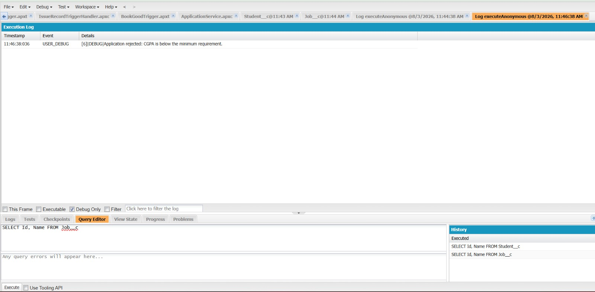

# Engineering Sprint 6 – Complete Application Workflow

# Sprint Objective

Complete the application workflow by integrating all previously implemented functionality into a single business process.

---

# Business Requirement

The application should follow the complete workflow:

- Receive the application request.
- Check for duplicate applications.
- Validate student eligibility.
- Save the application if eligible.
- Return an appropriate success or failure message.

---

# Task Completed

- Integrated all previous sprint functionality.
- Checked for duplicate applications.
- Validated student eligibility based on CGPA.
- Created and saved the Application record.
- Returned meaningful messages for each scenario.
- Handled DML exceptions using try-catch.

---

# Final Workflow

```text
Receive Application
        ↓
Check Duplicate
        ↓
Validate Eligibility
        ↓
Save Application
        ↓
Display Result
```

---

# Source Code

The final version of `ApplicationService.cls` includes:

- submitApplication() method
- Duplicate validation
- Eligibility validation
- Record creation using DML
- Exception handling

---

# Execute Anonymous

```apex
Id studentId = 'YOUR_STUDENT_ID';
Id jobId = 'YOUR_JOB_ID';

String result = ApplicationService.submitApplication(studentId, jobId);

System.debug(result);
```

---

# Test Scenarios

| Test Case | Expected Result |
|-----------|-----------------|
| Duplicate Application | You have already applied for this job. |
| Student CGPA below Minimum CGPA | Student is not eligible due to low CGPA. |
| Eligible Student | Application submitted successfully. |
| DML Error | Failed to save application. |

---

# Screenshots

## Debug Output


---

## Application Submission


---

## Application Rejected



---

# Learning Outcomes

During this sprint, I learned:

- Integrating multiple business rules into one Apex service.
- Combining SOQL, validation logic, and DML in a single workflow.
- Handling exceptions using try-catch.
- Testing complete business processes using Execute Anonymous.

---

# Challenges Faced

- Testing different application scenarios.
- Managing duplicate application logic.
- Verifying successful record creation.
- Understanding the complete business flow.

---

# Reflection

## What Went Well?

Successfully integrated all previous sprint features into a complete application workflow.

## What Was Difficult?

Testing every business scenario and ensuring the workflow behaved correctly.

## What Would I Improve?

Refactor the code into smaller helper methods for improved readability and maintainability.

## Engineering Lesson

Build software incrementally, validate business rules before saving data, and keep business logic organized in service classes.

---

# Conclusion

Successfully completed the final engineering sprint by integrating duplicate validation, eligibility checking, record creation, and exception handling into a single Apex service. The Placement Management System now follows a complete application workflow from receiving a request to storing a valid application in Salesforce.
