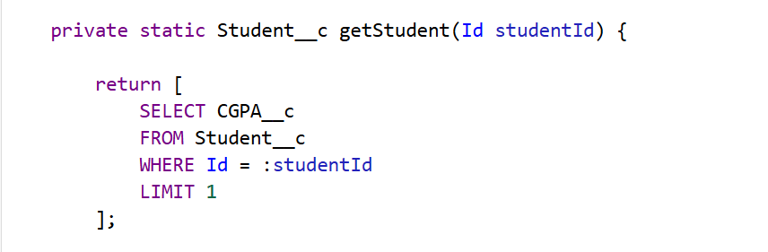
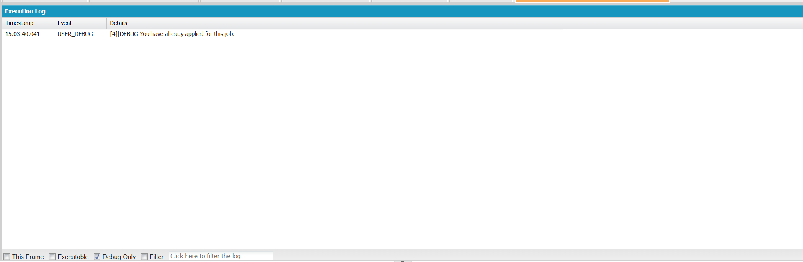

# Engineering Sprint 7 – Retrieving Student Information

# Sprint Objective

Retrieve the required Student information before processing a job application. The service should query only the fields needed for the current business decision.

---

# Business Requirement

Before validating an application, the software must identify the student by retrieving only the information required for eligibility validation.

---

# Tasks Completed

- Retrieved Student information using SOQL.
- Queried only the required field (CGPA).
- Used a helper method to improve code readability and maintainability.
- Prepared the Student data for eligibility validation.

---

# Engineering Principle

Retrieve only the information your business requires. Avoid unnecessary fields to improve performance and maintain clean code.

---

# Source Code

See `Source-Code/ApplicationService.cls`.

---

# Expected Behaviour

The application successfully retrieves the Student record before any validation begins.

---

# Screenshots

## Source Code

## Debug Output

---

# Learning Outcome

- Learned to retrieve records using SOQL.
- Learned to query only required fields.
- Improved code organization using helper methods.

---

# Conclusion

Successfully implemented Student information retrieval using SOQL while following Salesforce engineering best practices.
