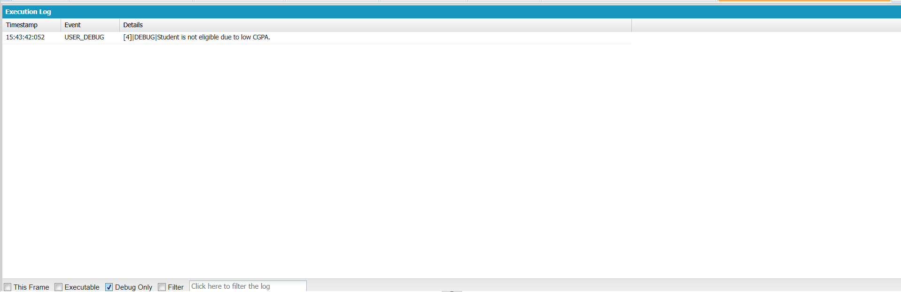

# Engineering Sprint 8 – Retrieving Job Information

# Sprint Objective

Retrieve the required Job information before validating a student's application.

---

# Business Requirement

Before checking eligibility, the system must retrieve only the Job information required for decision-making.

---

# Tasks Completed

- Retrieved Job information using SOQL.
- Queried only the required field (Minimum CGPA).
- Used a helper method to improve readability.
- Prepared Job information for eligibility validation.

---

# Engineering Principle

Retrieve only the information required by the current business process.

---

# Expected Behaviour

The application successfully retrieves the Job record before validating the student's eligibility.

---

# Screenshots

## Debug Output

---

# Learning Outcome

- Learned to retrieve Job records using SOQL.
- Learned to create reusable helper methods.
- Understood why unnecessary fields should not be queried.

---

# Conclusion

Successfully implemented Job information retrieval using SOQL before eligibility validation.
