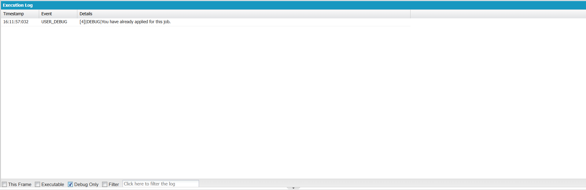
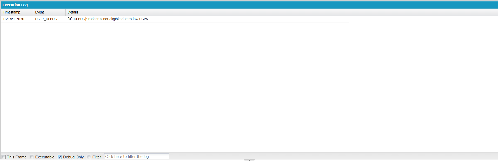

# Engineering Sprint 9 – Preventing Duplicate Applications

# Sprint Objective

Prevent students from submitting duplicate applications for the same job.

---

# Business Requirement

Before creating a new application, the system checks whether the student has already applied for the selected job.

If a duplicate exists, the application process is stopped and an appropriate message is returned.

---

# Tasks Completed

- Retrieved previous applications using SOQL.
- Checked for duplicate applications.
- Prevented duplicate record creation.
- Returned meaningful feedback to the user.

---

# Engineering Principle

Validate business rules before modifying data.

---

# Expected Behaviour

- First application → Continue.
- Duplicate application → Reject.
- Different company → Continue.

---

# Screenshots

## Debug Output

# Learning Outcome

- Learned to prevent duplicate records using SOQL.
- Learned to separate duplicate validation into a reusable helper method.
- Improved code readability and maintainability.

---

# Conclusion

Successfully implemented duplicate application validation before processing student applications.
